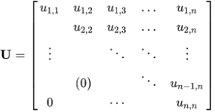
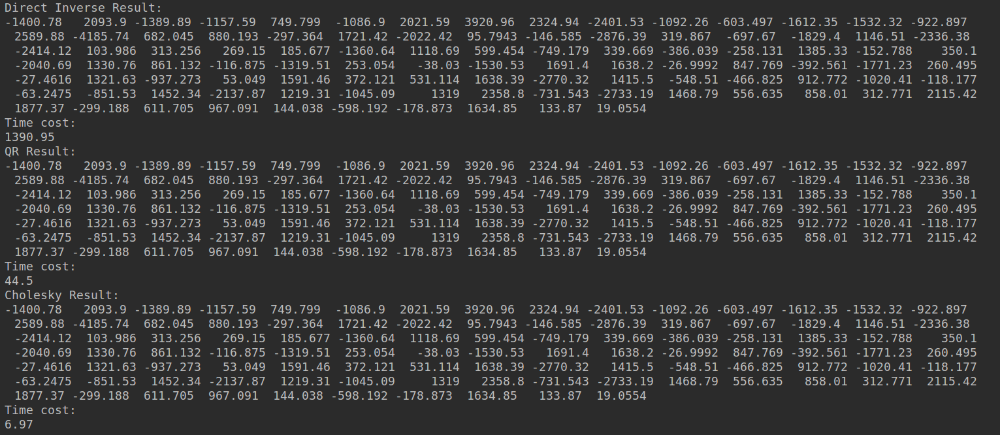
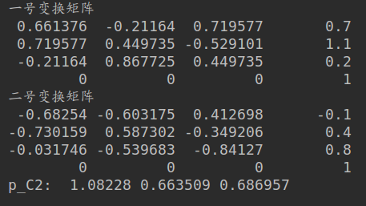
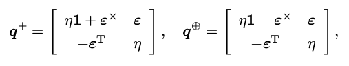
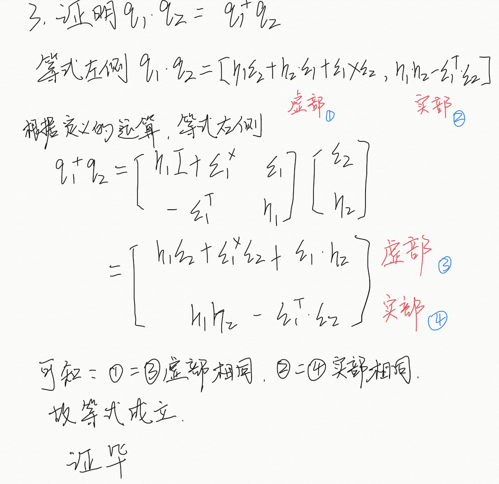
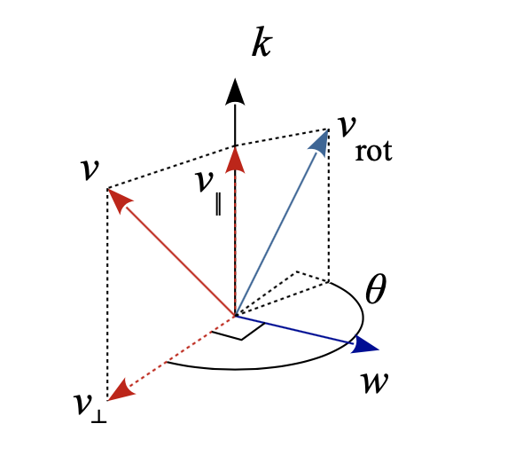
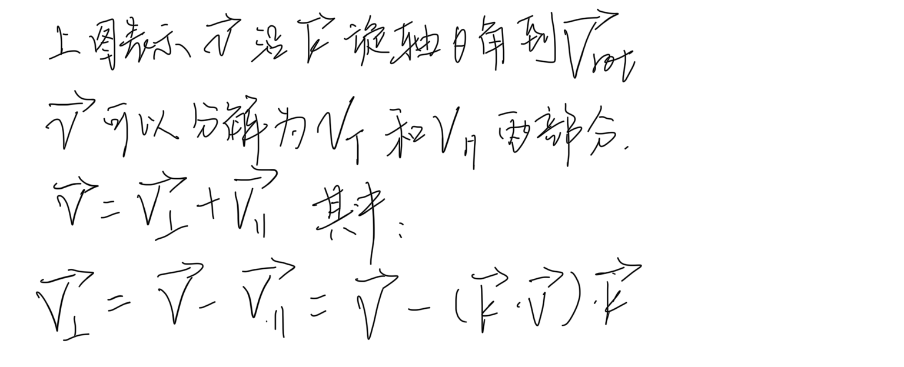
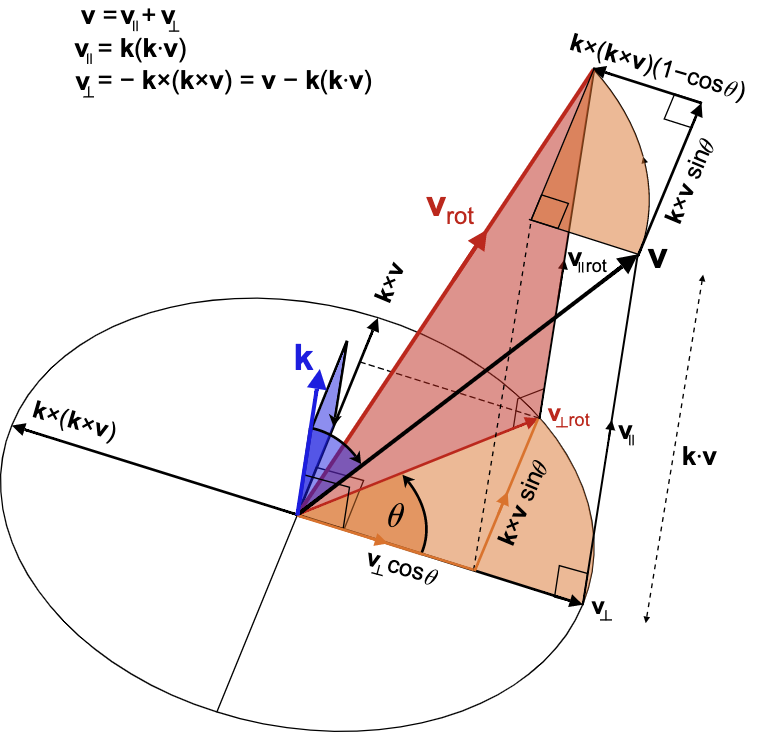
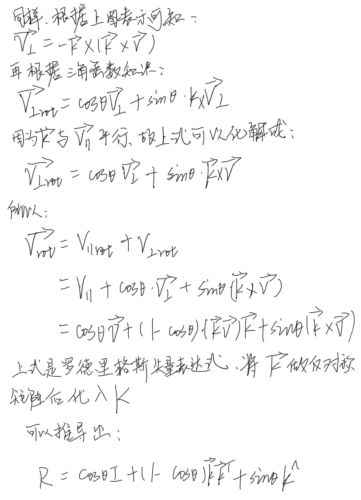
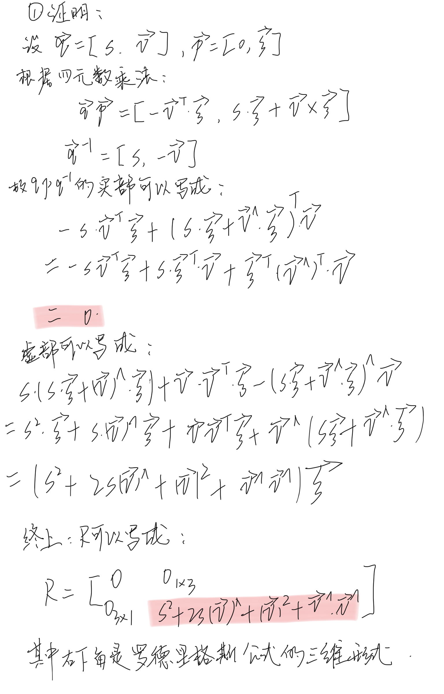

## 一、 熟悉Eigen矩阵运算

设线性方程 Ax = b,在 A 为方阵的前提下,请回答以下问题：
#### 1. 在什么条件下,x 有解且唯一？

**回答：**
系数矩阵A为非奇异矩阵，等价于：
- A可逆
- A行列式不为零
- A满秩

#### 2. 高斯消元法的原理是什么?
**回答：**

本质是利用线性方程组的初等变换。

大致分以下两步：

1. 加减消元为上三角矩阵



2. 回代求未知数

对于n阶矩阵，高斯消元法的算法复杂度是O(n3)

#### 3. QR 分解的原理是什么?

**回答：**

将矩阵分解为一个正交矩阵Q和一个上三角矩阵R相乘。常用于求解线性最小二乘问题。

#### 4. Cholesky 分解的原理是什么?

**回答：**

将正定的Hermite矩阵分解为下三角矩阵与其共轭转置矩阵的乘积

Hermite矩阵是实对称矩阵推广到虚数领域，或者说实对称矩阵是Hermite矩阵的一个特例。

#### 5. 编程实现 A 为 100 × 100 随机矩阵时,用 QR 和 Cholesky 分解求 x 的程序。

**回答：**

useEigen.cpp程序如下：

```c++
#include <iostream>
using namespace std;
#include <Eigen/Core>
#include <Eigen/Dense>
#include <Eigen/Cholesky>

#define SIZE 100
int main() {
    Eigen::Matrix<double, SIZE, SIZE>  A;
    A = Eigen::MatrixXd::Random(SIZE, SIZE);

    Eigen::Matrix<double, SIZE, 1> b;
    b = Eigen::MatrixXd::Random(SIZE,1);

    // 为顺利测试cholesky，需要对矩阵A进行一些处理
    A = A.array().abs();
    A = A.transpose()*A;

    //inverse
    clock_t time_start = clock();
    Eigen::Matrix<double, SIZE, 1> x1;
    x1  = A.inverse() * b;
    cout<<"Direct Inverse Result:\n"<<x1.matrix().transpose()<<endl;

    cout<<"Time cost:\n"<<(clock() - time_start)*1000/(double)CLOCKS_PER_SEC<<endl;

    //QR
    time_start = clock();
    Eigen::Matrix<double, SIZE, 1> x2;
    x2 = A.fullPivHouseholderQr().solve(b);
    cout<<"QR Result:\n"<<x2.matrix().transpose()<<endl;
    cout<<"Time cost:\n"<<(clock() - time_start)*1000/(double)CLOCKS_PER_SEC<<endl;

    //Cholesky
    time_start = clock();
    Eigen::Matrix<double, SIZE, 1> x3;
    x3 = A.ldlt().solve(b);
    cout<<"Cholesky Result:\n"<<x3.matrix().transpose()<<endl;
    cout<<"Time cost:\n"<<(clock() - time_start)*1000/(double)CLOCKS_PER_SEC<<endl;

    return 0;
}

```
**程序运行结果:**




**程序关键处说明:**

1. 因为cholesky分解要求矩阵为正定阵，所以我在程序中对随机生成的100维矩阵做了处理，先变成全为正数的矩阵，然后与其转置相乘，这样可以保证矩阵的正定！

2. 三者求出来的解结果完全相同。
同样的矩阵处理时间如下： 正常求逆用时：1390.05ms; QR分解用时：44.5ms; cholesky用时6.97ms

## 二、几何运算练习

设有小萝卜一号和小萝卜二号位于世界坐标系中。小萝卜一号的位姿为: q1 = [0.55, 0.3, 0.2, 0.2], t1 =
[0.7, 1.1, 0.2]T (q的第一项为实部)。这里的 q 和 t 表达的是 Tcw ,也就是世界到相机的变换关系。小萝卜二号的位姿为 q2 = [−0.1, 0.3, −0.7, 0.2]T, t2 = [−0.1, 0.4, 0.8]T 。现在,小萝卜一号看到某个点在自身的坐标系下,坐标为 p1 = [0.5, −0.1, 0.2]T ,求该向量在小萝卜二号坐标系下的坐标。请编程实现此事,并提交你的程序。

**回答：**

```c++
#include <iostream>
#include <Eigen/Core>
#include <Eigen/Geometry>

using namespace std;
using namespace Eigen;

int main() {

    // 定义变换矩阵T1
    Isometry3d T_C1_W = Isometry3d::Identity();
    Quaterniond q_C1_W(0.55,0.3,0.2,0.2);
    T_C1_W.rotate(q_C1_W.normalized().toRotationMatrix());
    T_C1_W.pretranslate(Vector3d(0.7,1.1,0.2));

    cout<<"一号变换矩阵 \n"<<T_C1_W.matrix()<<endl;

    // 定义变换矩阵T2
    Isometry3d T_C2_W = Isometry3d::Identity();
    Quaterniond q_C2_W(-0.1,0.3,-0.7,0.2);
    T_C2_W.rotate(q_C2_W.normalized().toRotationMatrix());
    T_C2_W.pretranslate(Vector3d(-0.1,0.4,0.8));

    cout<<"二号变换矩阵 \n"<<T_C2_W.matrix()<<endl;

    Vector3d p_C1(0.5,-0.1,0.2);
    Vector3d p_C2 = T_C2_W * T_C1_W.inverse() * p_C1;
    cout<<"p_C2: "<<p_C2.transpose()<<endl;

    return 1;

}

```
**程序运行结果：**


## 三、  旋转的表达

#### 1. 设有旋转矩阵 R,证明 R^T R = I 且 det R = +1

**回答：**



#### 2. 设有四元数 q,我们把虚部记为 ε,实部记为 η,那么 q = (ε, η)。请说明 ε 和 η 的维度。

**回答：**

其中虚部 ε 是三维, 实部 η 为1维


#### 3. 定义如下运算：



证明对于两个四元数q1,q2，四元数的乘法可以写成：q1.q2 = (q1^+).q2

**回答：**



## 四、罗德里格斯公式证明
**回答：**






## 五、四元数运算性质的验证

**回答：**



## 六、熟悉C++11

设有类 A,并有 A 类的一组对象,组成了一个 vector。现在希望对这个 vector 进行排序,但排序的
方式由 A.index 成员大小定义。那么,在 C++11 的语法下,程序写成:

```c++
#include <iostream>
#include <vector>
#include <algorithm>
using namespace std;

class A {
public:
    A(const int& i ) : index(i) {}
    int index = 0;
};

int main() {
    A a1(3), a2(5), a3(9);
    vector<A> avec{a1, a2, a3};
    std::sort(avec.begin(), avec.end(), [](const A&a1, const A&a2) {return a1.index<a2.index;});
    for ( auto& a: avec ) cout<<a.index<<" ";
    cout<<endl;
    return 0;
}
```

请说明该程序中哪些地方用到了 C++11 标准的内容。提示:请关注范围 for 循环、自动类型推导、 lambda表达式等内容。

**回答：**
