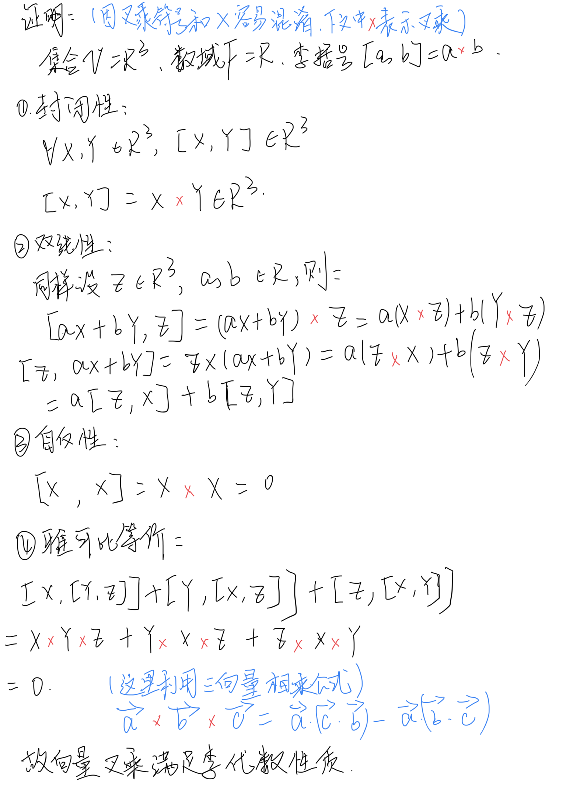
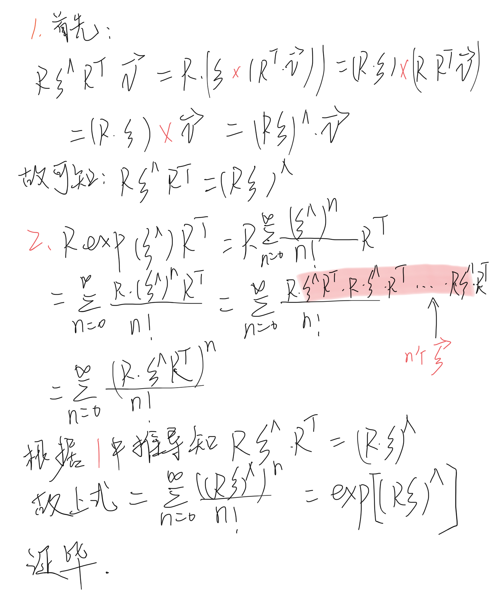
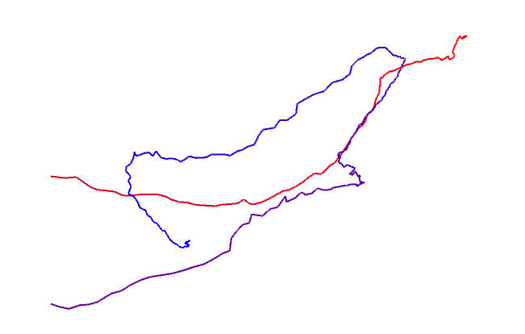
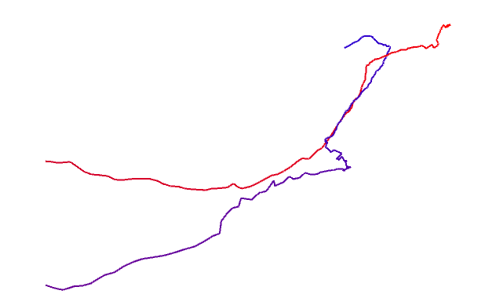

## 一、群的性质
#### 1. {Z, +}是否为群？若是,验证其满足群定义;若不是,说明理由。其中 Z 为整数集。

**回答：**

是

根据群的四性质：

1. 封闭性：任意两个整数做加法运算，仍然是属于整数集合
2. 结合律：任意三个整数做加法运算，他们相加的先后顺序不影响最终结果
3. 幺元：0与任意整数做加法，该整数的值不变
4. 逆：任意整数的逆为其相反数（在加法运算的集合内），那么-Z + Z = 0 对任意整数都成立，0也是整数。

#### 2. {N, +}是否为群？若是,验证其满足群定义;若不是,说明理由。其中 N 为自然数集。

**回答：**

不是，因为不满足第四条逆的规则。

自然数是非负整数，正整数的逆为负整数不属于自然数集合内。

## 二、验证向量叉乘的李代数性质

**回答：**



## 三、推导SE(3)的指数映射

**回答：**


## 四、证明SO(3)的伴随性质

**回答：**



## 五、轨迹的描绘

#### 1. Twc 的平移部分构成机器人的轨迹，它的物理意义是什么？为什么画出Twc的平移部分就得到机器人的轨迹？

**回答：**

Twc的平移部分就是机器人相对于世界坐标系的坐标点，所以画出Twc之后，就等于在世界坐标系下，画出机器人一系列的坐标点，连接起来就是机器人的轨迹图。我们在观察机器人移动的轨迹其实就是在看机器人相对map坐标系的位置。

#### 2. 使用提供好的轨迹文件和画图程序，完成数据读取部分代码，书写CMakeLists.txt让程序运行起来。

**CMakeLists.txt文件**

```json
cmake_minimum_required(VERSION 2.8)
project(homework3)

# 下面这句保证pangolin正常编译通过
set(CMAKE_CXX_FLAGS "-std=c++11")

find_package(Pangolin REQUIRED)
find_package( Sophus REQUIRED )

include_directories( ${Sophus_INCLUDE_DIRS} )
include_directories(
        ${PROJECT_SOURCE_DIR}
        ${Pangolin_INCLUDE_DIRS}
)

set(CMAKE_RUNTIME_OUTPUT_DIRECTORY ${PROJECT_SOURCE_DIR}/MyWork)
add_executable(draw_trajectory draw_trajectory.cpp)

target_link_libraries(draw_trajectory ${Pangolin_LIBRARIES} ${Sophus_LIBRARIES})
```

**主函数部分cpp文件**

```cpp
// path to trajectory file
string trajectory_file = "../trajectory.txt";


// function for plotting trajectory, don't edit this code
// start point is red and end point is blue
void DrawTrajectory(vector<Sophus::SE3, Eigen::aligned_allocator<Sophus::SE3>>);

int main(int argc, char **argv) {

    vector<Sophus::SE3, Eigen::aligned_allocator<Sophus::SE3>> poses;

    /// implement pose reading code
    // start your code here (5~10 lines)
    Eigen::Quaterniond q;
    Eigen::Vector3d t;
    Sophus::SE3 T;
    ifstream trajectory;
    double time_stamp;

    trajectory.open(trajectory_file.c_str());
    if (!trajectory.is_open()){
        cout << "the file is empty!!" << endl;
        return -1;
    }

    string sLine;
    while(getline(trajectory, sLine) && !sLine.empty()){
        istringstream iss(sLine);
        iss >> time_stamp >> t[0] >> t[1] >> t[2] >> q.x() >> q.y() >> q.z() >> q.w();
        T = Sophus::SE3(q, t);
        poses.push_back(T);
    }
    trajectory.close();

    // end your code here

    // draw trajectory in pangolin
    DrawTrajectory(poses);
    return 0;
}

```

输出轨迹：




**这个题我做得挺坎坷：耗费了好长时间**

使用第一个电脑画出来的图如下：



图片一直在抖，无法画完整全部，轨迹最后没有连接到蓝色部分。不知道为什么，我找了很久代码问题，觉得没问题。

最后我换了电脑尝试同样的代码，然后就顺利输出了。

有时候啊，这环境到底咋回事，真的是很难说清楚。按道理我的两个linux电脑的环境都一样，使用的pagolin和sophus包也是一样的。


## 六、轨迹的误差

利用提供的两个txt轨迹文件，实现RMSE的计算代码，给出最终结果。

**回答：**


将两条轨迹画在同一个图里，观察轨迹之间的误差。

**回答：**
