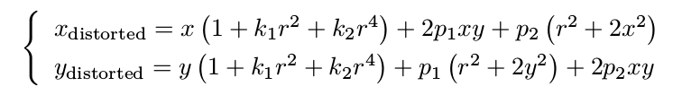

## 一、图像去畸变

应用如下畸变坐标变换公式：

以及畸变参数 k1,k2,k3,p1,p2和相机内参fx,fy(两个数值通常差不多)，cx,cy

根据undistort_image.cpp搭建好的框架，实现图像图畸变。

## 二、双目视差的使用

经典双目恢复深度的算法有 BM(Block Matching), SGBM(Semi-Global Block Matching) 等,
但本题不探讨立体视觉内容(那是一个大问题)。我们假设双目计算的视差已经给定,请你根据双目模型,
画出图像对应的点云,并显示到 Pangolin 中。程序请参考 code/disparity.cpp 文件。

## 三、矩阵运算微分

在优化中经常会遇到矩阵微分的问题。例如,当自变量为向量 x,求标量函数 u(x) 对 x 的导数时,即
为矩阵微分。

阅读清华研究生课的矩阵论课件,回答下列问题:

设变量为 x ∈ R^N ,那么:
#### 1. 矩阵 A ∈ R^(N ×N) ,那么 d(Ax)/dx 是什么?

#### 2. 矩阵 A ∈ R^(N ×N) ,那么 d(x^T*A*x)/dx 是什么?

#### 3. 证明:    x^T*A*x = tr(A*x*x^T).

## 四、高斯牛顿法的曲线拟合实验
自己实现一遍高斯牛顿的迭代过程,求解曲线的参数。

## 五、批量最大似然估计

#### 1. 可以定义矩阵 H,使得批量误差为 e = z − Hx。请给出此处 H 的具体形式。
#### 2. 据上问,最大似然估计可转换为最小二乘问题:

x^* = arg min (1/2)*(z − Hx)^T * W^(-1)*(z − Hx)

其中 W 为此问题的信息矩阵,可以从最大似然的概率定义给出。请给出此问题下 W 的具体取值。

#### 3. 假设所有噪声相互无关,该问题存在唯一的解吗?若有,唯一解是什么?若没有,说明理由。
