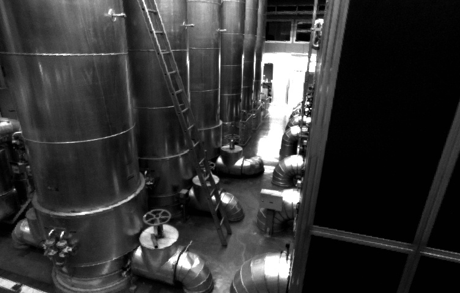
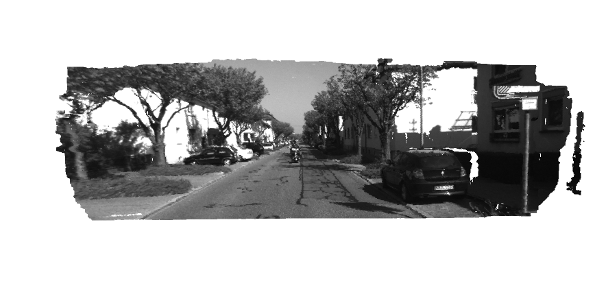
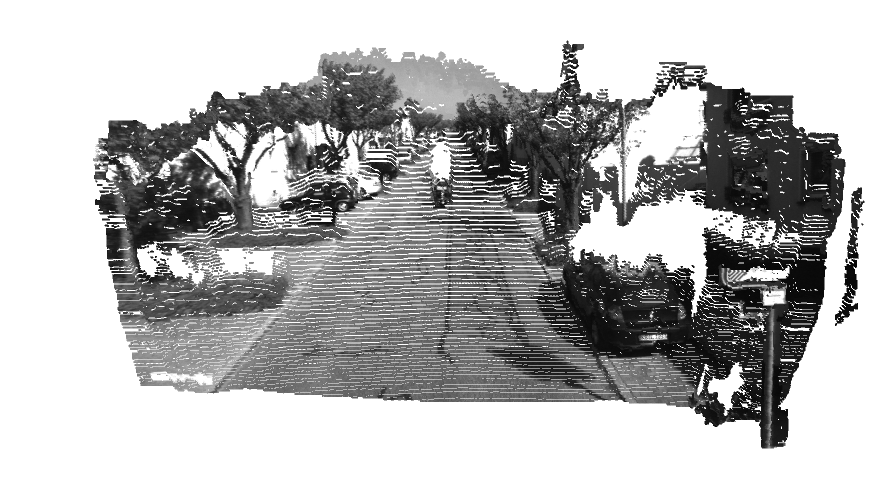

## 一、图像去畸变

应用如下畸变坐标变换公式：


以及畸变参数 k1,k2,k3,p1,p2和相机内参fx,fy(两个数值通常差不多)，cx,cy

根据undistort_image.cpp搭建好的框架，实现图像图畸变。

**回答：**

undistort_image.cpp编写：
```cpp
//
// Created by 徐志 on 2019/07/07.
//

#include <opencv2/opencv.hpp>
#include <string>

using namespace std;

string image_file = "../test.png";   // 请确保路径正确

int main(int argc, char **argv) {

    // 本程序需要你自己实现去畸变部分的代码。尽管我们可以调用OpenCV的去畸变，但自己实现一遍有助于理解。
    // 畸变参数
    double k1 = -0.28340811, k2 = 0.07395907, p1 = 0.00019359, p2 = 1.76187114e-05;
    // 内参
    double fx = 458.654, fy = 457.296, cx = 367.215, cy = 248.375;

    cv::Mat image = cv::imread(image_file,0);   // 图像是灰度图，CV_8UC1
    int rows = image.rows, cols = image.cols;
    cv::Mat image_undistort = cv::Mat(rows, cols, CV_8UC1);   // 去畸变以后的图

    double r_2, r_4, x, y, x_distorted, y_distorted;
    // 计算去畸变后图像的内容
    for (int v = 0; v < rows; v++)
        for (int u = 0; u < cols; u++) {

            double u_distorted = 0, v_distorted = 0;
            // TODO 按照公式，计算点(u,v)对应到畸变图像中的坐标(u_distorted, v_distorted) (~6 lines)
            // start your code here
            x = (u-cx)/fx;
            y = (v-cy)/fy;
            r_2 = x*x + y*y;
            r_4 = r_2 * r_2;

            x_distorted = x * (1 + k1*r_2 + k2 *r_4) + 2*p1*x*y + p2*(r_2 + 2* x * x);
            y_distorted = y * (1+k1*r_2+k2*r_4)+p1*(r_2+2*y*y)+2*p2*x*y;

            u_distorted = x_distorted * fx + cx;
            v_distorted = y_distorted * fy + cy;
            // end your code here

            // 赋值 (最近邻插值)
            if (u_distorted >= 0 && v_distorted >= 0 && u_distorted < cols && v_distorted < rows) {
                image_undistort.at<uchar>(v, u) = image.at<uchar>((int) v_distorted, (int) u_distorted);
            } else {
                image_undistort.at<uchar>(v, u) = 0;
            }
        }

    // 画图去畸变后图像
    cv::imshow("image undistorted", image_undistort);
    cv::waitKey();
    cv::imwrite("../undistorted.jpg", image_undistort);
    return 0;
}

```

对应的CMakeLists.txt文件：

```c
cmake_minimum_required( VERSION 2.8 )
project( code )

# 添加c++ 11标准支持
set( CMAKE_CXX_FLAGS "-std=c++11" )

# 寻找OpenCV库
find_package( OpenCV REQUIRED )
# 添加头文件
include_directories( ${OpenCV_INCLUDE_DIRS} )

add_executable( undistort_image undistort_image.cpp )
# 链接OpenCV库
target_link_libraries( undistort_image ${OpenCV_LIBS} )
```

**输出结果**

矫正前：


矫正后：




## 二、双目视差的使用

经典双目恢复深度的算法有 BM(Block Matching), SGBM(Semi-Global Block Matching) 等,
但本题不探讨立体视觉内容(那是一个大问题)。我们假设双目计算的视差已经给定,请你根据双目模型,
画出图像对应的点云,并显示到 Pangolin 中。程序请参考 code/disparity.cpp 文件。

**分析**

目的就是根据双目计算公式，给原本没有z的距离数据补齐

**代码部分**

disparity.cpp文件主函数部分

```cpp

int main(int argc, char **argv) {

    // 内参
    double fx = 718.856, fy = 718.856, cx = 607.1928, cy = 185.2157;
    // 间距:baseline
    double d = 0.573;
    // 归一化坐标中的x, y
    double x_normal, y_normal;

    // 读取图像
    cv::Mat left = cv::imread(left_file, 0);
    cv::Mat right = cv::imread(right_file, 0);
    cv::Mat disparity = cv::imread(disparity_file, 0); // disparty 为CV_8U,单位为像素

    // 生成点云
    vector<Vector4d, Eigen::aligned_allocator<Vector4d>> pointcloud;

    // TODO 根据双目模型计算点云
    // 根据d，求出z
    for (int v = 0; v < left.rows; v++)
        for (int u = 0; u < left.cols; u++) {
            Vector4d point(0, 0, 0, left.at<uchar>(v, u) / 255.0); // 前三维为xyz,第四维为颜色
            // start your code here (~6 lines)
            // 根据双目模型计算 point 的位置 z = f*b/d

            auto z = fx*d/(disparity.at<uchar>(v,u));

            x_normal = (u-cx)/fx;
            y_normal = (v-cy)/fy;

            point[0] = x_normal * z;
            point[1] = y_normal * z;
            point[2] = z;
            pointcloud.push_back(point);

            // end your code here
        }

    // 画出点云
    showPointCloud(pointcloud);
    return 0;
}
```

cmakelist文件

```c
cmake_minimum_required( VERSION 2.8 )
project( code )

# 添加c++ 11标准支持
set( CMAKE_CXX_FLAGS "-std=c++11" )

# 寻找OpenCV库
find_package( OpenCV REQUIRED )
find_package(Pangolin REQUIRED)

INCLUDE_DIRECTORIES(${OpenCV_INCLUDE_DIRS}
        "/usr/include/eigen3/"
        ${Pangolin_INCLUDE_DIRS})

add_executable(disparity disparity.cpp)
target_link_libraries( disparity ${Pangolin_LIBRARIES} ${OpenCV_LIBS} )

```

**输出结果：**

可以看出在没有图像的地方，我们是无法得到深度值的。





## 三、矩阵运算微分

在优化中经常会遇到矩阵微分的问题。例如,当自变量为向量 x,求标量函数 u(x) 对 x 的导数时,即
为矩阵微分。

阅读清华研究生课的矩阵论课件,回答下列问题:

设变量为 x ∈ R^N ,那么:
#### 1. 矩阵 A ∈ R^(N ×N) ,那么 d(Ax)/dx 是什么?


#### 2. 矩阵 A ∈ R^(N ×N) ,那么 d(x^T*A*x)/dx 是什么?


#### 3. 证明:    x^T*A*x = tr(A*x*x^T).


## 四、高斯牛顿法的曲线拟合实验
自己实现一遍高斯牛顿的迭代过程,求解曲线的参数。


**gaussnewton.cpp代码部分**

```cpp
int main(int argc, char **argv) {
    double ar = 1.0, br = 2.0, cr = 1.0;         // 真实参数值
    double ae = 2.0, be = -1.0, ce = 5.0;        // 估计参数值  这里等于是给了个初始值
    int N = 100;                                 // 数据点
    double w_sigma = 1.0;                        // 噪声Sigma值
    cv::RNG rng;                                 // OpenCV随机数产生器

    vector<double> x_data, y_data;      // 数据
    for (int i = 0; i < N; i++) {
        double x = i / 100.0;
        x_data.push_back(x);
        y_data.push_back(exp(ar * x * x + br * x + cr) + rng.gaussian(w_sigma));
    }

    // 开始Gauss-Newton迭代
    int iterations = 100;    // 迭代次数
    double cost = 0, lastCost = 0;  // 本次迭代的cost和上一次迭代的cost

    for (int iter = 0; iter < iterations; iter++) {

        Matrix3d H = Matrix3d::Zero();             // Hessian = J^T J in Gauss-Newton
        Vector3d b = Vector3d::Zero();             // bias
        cost = 0;

        // 这个计算量真的大，每一次迭代都要求H和b
        for (int i = 0; i < N; i++) {
            double xi = x_data[i], yi = y_data[i];  // 第i个数据点

            // start your code here
            double error = 0;   // 第i个数据点的计算误差
            error = yi - exp(ae*xi*xi+be*xi+ce); // 填写计算error的表达式
            Vector3d J; // 雅可比矩阵
            double temp = -exp(ae*xi*xi+be*xi+ce);
            J[0] = temp*xi*xi;  // de/da
            J[1] = temp*xi;  // de/db
            J[2] = temp;  // de/dc

            H += J * J.transpose(); // GN近似的H
            b += -error * J;    // 这里的error是个标量
            // end your code here

            cost += error * error; // 保证不被正负抵消
        }

        // todo 求解线性方程 Hx=b，建议用ldlt
 	// start your code here
        Vector3d dx;
        // 这里的dx面向的是abc，是abc的步进
        dx = H.ldlt().solve(b);
        // cout << dx[0] << "  " << dx[1] << "  " << dx[2] << endl;
	// end your code here

        if (isnan(dx[0])) {
            cout << "result is nan!" << endl;
            break;
        }

        if (iter > 0 && cost > lastCost) {
            // 误差增长了，说明近似的不够好
            cout << "cost: " << cost << ", last cost: " << lastCost << endl;
            break;
        }

        // 更新abc估计值
        ae += dx[0];
        be += dx[1];
        ce += dx[2];

        lastCost = cost;

        cout << "total cost: " << cost << endl;
    }

    cout << "estimated abc = " << ae << ", " << be << ", " << ce << endl;
    return 0;
}
```


**对应的CMakeLists**
```c
cmake_minimum_required( VERSION 2.8 )
project( code )

# 添加c++ 11标准支持
set( CMAKE_CXX_FLAGS "-std=c++11" )

# 寻找OpenCV库
find_package( OpenCV REQUIRED )
INCLUDE_DIRECTORIES(${OpenCV_INCLUDE_DIRS})

add_executable(gaussnewton gaussnewton.cpp)
target_link_libraries( gaussnewton ${OpenCV_LIBS} )

```

**输出结果：**

```json
total cost: 3.19575e+06
total cost: 376785
total cost: 35673.6
total cost: 2195.01
total cost: 174.853
total cost: 102.78
total cost: 101.937
total cost: 101.937
total cost: 101.937
total cost: 101.937
total cost: 101.937
total cost: 101.937
total cost: 101.937
cost: 101.937, last cost: 101.937
estimated abc = 0.890912, 2.1719, 0.943629
```

输出结果与高博给的保持一直。算法提前退出的原因是出现了误差增长的情况


## 五、批量最大似然估计

#### 1. 可以定义矩阵 H,使得批量误差为 e = z − Hx。请给出此处 H 的具体形式。


#### 2. 据上问,最大似然估计可转换为最小二乘问题:

x^* = arg min (1/2)*(z − Hx)^T * W^(-1)*(z − Hx)

其中 W 为此问题的信息矩阵,可以从最大似然的概率定义给出。请给出此问题下 W 的具体取值。

#### 3. 假设所有噪声相互无关,该问题存在唯一的解吗?若有,唯一解是什么?若没有,说明理由。
