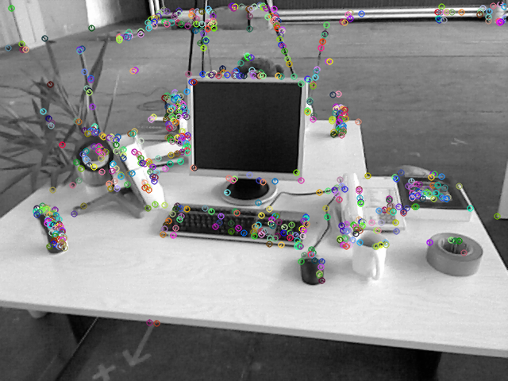
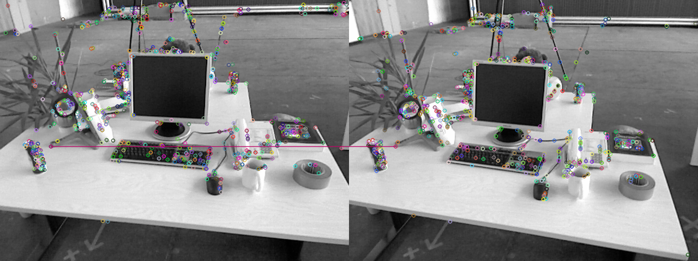
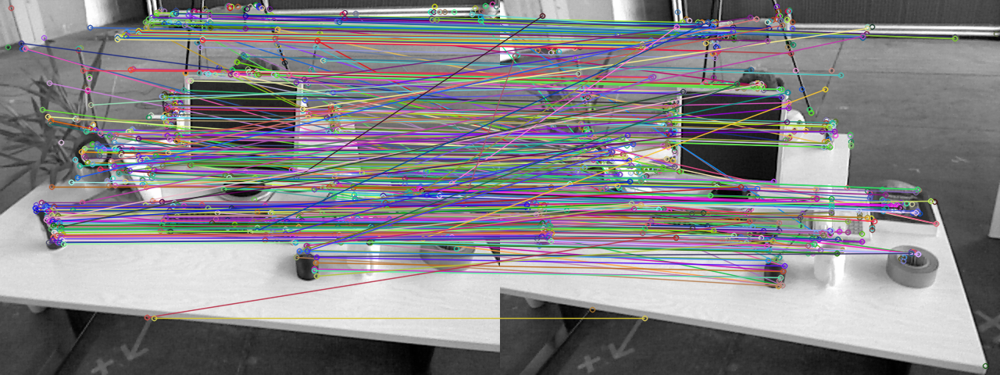
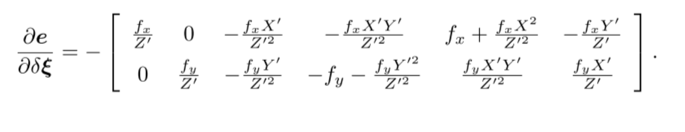
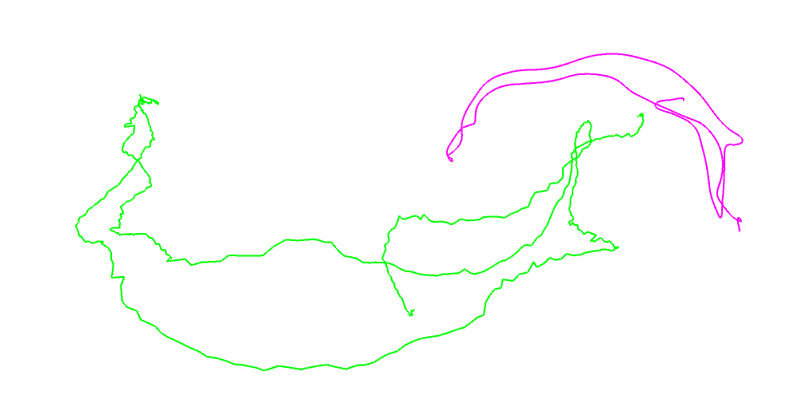
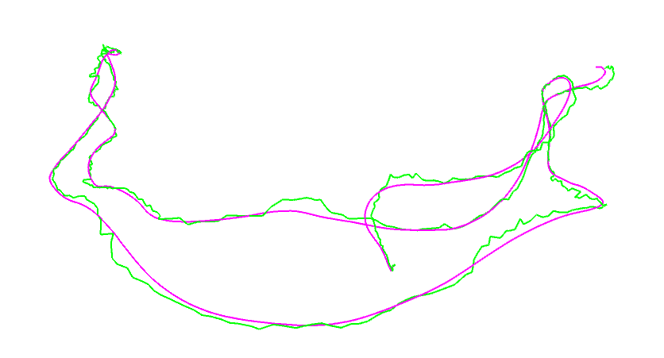

## 一、ORB特征点

按照本题的指导,自行书写 ORB 的提取、描述子的计算以及
匹配的代码。代码框架参照 computeORB.cpp 文件,图像见 1.png 文件和 2.png。

#### 1. ORB提取

ORB即Oriented FAST简称，他实际上是FAST特征再加上一个旋转量。本题使用OpenCV自带的FAST提取算法，你要完成旋转部分的计算。

代码部分：

```cpp
void computeAngle(const cv::Mat &image, vector<cv::KeyPoint> &keypoints) {
    int half_patch_size = 8;

    for (auto &kp : keypoints) {
	// TODO: START YOUR CODE HERE (~7 lines)
        kp.angle = 0; // compute kp.angle
        int u = kp.pt.x;
        int v = kp.pt.y;
        if (u >= half_patch_size && u <= image.cols-half_patch_size
        && v >= half_patch_size && v < image.rows - half_patch_size) {

            double m_10 = 0;
            double m_01 = 0;
            for (int i = - half_patch_size; i < half_patch_size; ++i) {
                for (int j =- half_patch_size; j < half_patch_size; ++j) {
                    double intensity = (double)image.at<uchar>(v + j,u + i);
                    m_01 += j*intensity;
                    m_10 += i*intensity;
                }
            }
            kp.angle = (float)atan2(m_01, m_10) * 180 / pi;
        }

        // END YOUR CODE HERE
    }
    return;
}

```

CMakeList.txt文件：

```
cmake_minimum_required( VERSION 2.8 )
project( vo1 )

set( CMAKE_BUILD_TYPE "Debug" )
set( CMAKE_CXX_FLAGS "-std=c++11 -O3" )

# 添加cmake模块以使用g2o
list( APPEND CMAKE_MODULE_PATH ${PROJECT_SOURCE_DIR}/cmake_modules )

# find_package( OpenCV 3.1 REQUIRED )
find_package( OpenCV REQUIRED ) # use this if in OpenCV2

include_directories(
        ${OpenCV_INCLUDE_DIRS}
        "/usr/include/eigen3/"
)

add_executable( computeORB computeORB.cpp  )
target_link_libraries( computeORB ${OpenCV_LIBS} )

```

最终输出的带旋转的FAST特征如下图所示：




**实现过程中的注意事项：**

1. computeAngle函数中输入的是灰度图像

2. image.at(x,y)取对应的坐标intensity值的时候，要注意这里的x代表rows, y代表cols.

3. kp.pt.x 和kp.pt.y中对应的x, y与像素坐标下的u，v对应，也就是x表示cols,y表示rows.

4. 在定义图像块的矩计算的时候，其中的x,y 表示的是16×16的图像块的u，v. 这一部分一定要搞明白，我整整调了两个小时，才弄出正确的结果！！！


#### 2. ORB描述

ORB描述即带旋转的BRIEF描述。指的是一个0-1组成的字符串，每个bit表示一次像素间的比较。

代码实现：
```cpp
bool inImage(int a, int b){
    return a>= 0 && a  < 640 && b  >= 0 && b < 480;
}

// compute the descriptor
void computeORBDesc(const cv::Mat &image, vector<cv::KeyPoint> &keypoints, vector<DescType> &desc) {
    // 对于每个特征点
    for (auto &kp: keypoints) {
        DescType d(256, false);
        int u = kp.pt.x;
        int v = kp.pt.y;
        double theta = kp.angle*pi/180;
        int u1_update, v1_update, u2_update, v2_update;

        for (int i = 0; i < 256; i++) {
            // TODO: START YOUR CODE HERE (~7 lines)
            d[i] = 0;  // if kp goes outside, set d.clear()

            u1_update =u + (int) (cos(theta) * ORB_pattern[i*4] -sin(theta) * ORB_pattern[i*4+1]);
            v1_update =v + (int)  (sin(theta) * ORB_pattern[i*4] + cos(theta)* ORB_pattern[i*4+1]);

            u2_update =u + (int) (cos(theta) * ORB_pattern[i*4 + 2] -sin(theta) * ORB_pattern[i*4 + 3]);
            v2_update =v + (int) (sin(theta) * ORB_pattern[i*4 + 2] + cos(theta) * ORB_pattern[i*4 + 3]);

            if (!inImage(u1_update,v1_update) || !inImage(u2_update,v2_update)){
                d.clear();
                break;
            }else{
                double intensity1 = image.at<uchar>(v1_update,u1_update);
                double intensity2 = image.at<uchar>(v2_update, u2_update);
                d[i] = (intensity1 > intensity2) ? 0 : 1;
            }
	    // END YOUR CODE HERE
        }
        desc.push_back(d);
    }

    int bad = 0;
    for (auto &d: desc) {
        if (d.empty()) bad++;
    }
    cout << "bad/total: " << bad << "/" << desc.size() << endl;
    return;
}
```

输出结果：
```json
keypoints: 638
bad/total: 41/638
keypoints: 595
bad/total: 6/595
```

过程分析：
1. 作业中描述子的类型如下，每个描述子都是用256个bool量组成的vector表示：
`typedef vector<bool> DescType`

2. 在keypoint附近找p,q的时候，先旋转p,q，再更新keypoint，然后判断更新后的keypoint是否越界，最后才是从image中找对应的灰度值，做0,1判断。我上述的这个过程非常重要，因为程序顺序有误的话，最后完全不正确。

3. 一定一定要分清楚，在opencv中取像素值的时候，下标与u,v设定正好相反。

#### 3. 暴力匹配

在提取和描述操作之后，我们需要根据描述子进行匹配。暴力匹配是一种简单粗暴的方法，特征点不多的时候很有用。

代码部分：

```cpp

void bfMatch(const vector<DescType> &desc1, const vector<DescType> &desc2, vector<cv::DMatch> &matches) {
    int d_max = 50;
    // TODO: START YOUR CODE HERE (~12 lines)
    // find matches between desc1 and desc2.

    steady_clock::time_point t1 = steady_clock::now();

    DescType d1, d2;

    for (int i = 0; i < desc1.size(); ++i) {

        int d_min = 256, minIndex = 0;
        d1 = desc1[i];
        if (d1.empty()) continue;

        for (int j = 0; j < desc2.size(); ++j) {
            int distance = 0;
            d2 = desc2[j];
            if (d2.empty()) continue;
            for (int k = 0; k < 256; ++k) {
                if (d1[k] ^ d2[k]){
                    distance += 1;
                }
            }

            if (distance < d_min){
                d_min = distance;
                minIndex = j;
            }
        }

        if (d_min > 0 && d_min < d_max){
            DMatch match;
            match.queryIdx = i;
            match.trainIdx = minIndex;
            match.distance = d_min;
            matches.push_back(match);
        }
    }

    steady_clock::time_point t2 = steady_clock::now();
    duration<double> time_used = duration_cast<duration<double>>(t2 - t1);
    cout << " Match time cost= " << time_used.count() << " seconds." << endl;
    // END YOUR CODE HERE

    for (auto &m: matches) {
        cout << m.queryIdx << ", " << m.trainIdx << ", " << m.distance << endl;
    }
    return;
}

```


输出结果：


终端输出结果：（截取了其中一部分）

```
601, 569, 34
604, 529, 31
606, 536, 44
608, 566, 39
613, 540, 37
614, 534, 48
622, 552, 42
631, 586, 42
632, 587, 40
633, 588, 30
634, 588, 47
637, 593, 48
matches: 103
done.
```


#### 4. 结合实验回答问题

1. 为什么说ORB是一种二进制特征？

**回答：**

因为我们的特征点的描述子使用的是二进制形式描述周围环境。

2. 为什么在匹配的时候使用50做阈值，取更大或者更小会怎样？

**回答：**

因为距离最大就是256,这样设定距离可以防止每次都能匹配上。

当d_max取20的时候：



当d_max取80的时候：



从上图中可以清晰看到，阈值的设定会极大的影响match对数。

3. 暴力匹配在你的机器上表现如何？ 你能想到和什么减少计算量的匹配方法吗？


**回答：**


Match time cost= 0.137723 seconds.

打印了下时间，可以看到做一次暴力match耗时0.137723秒，我对这个时间没概念。

我想到的减少计算量的匹配方法：

每次做特征点匹配的时候，不要从头到尾挨个计算，每次只求第一幅图片中特征点的坐标对应到第二张图的某个范围中做特征点匹配。这样做的假设就是两帧图像之间相机移动不会太大。我觉得这个假设是合理的。

## 二、从E恢复R和t
我们在书中讲到了单目对极几何部分,可以通过本质矩阵 E,得到旋转和平移 R, t,但那时直接使用了
OpenCV 提供的函数。本题中,请你根据数学原理,完成从 E 到 R, t 的计算。

代码部分：

```cpp
int main(int argc, char **argv) {

    // 给定Essential矩阵
    Matrix3d E;
    E << -0.0203618550523477, -0.4007110038118445, -0.03324074249824097,
            0.3939270778216369, -0.03506401846698079, 0.5857110303721015,
            -0.006788487241438284, -0.5815434272915686, -0.01438258684486258;

    // 待计算的R,t
    Matrix3d R;
    Vector3d t;

    // SVD and fix sigular values
    // START YOUR CODE HERE
    JacobiSVD<Eigen::MatrixXd> svd(E, ComputeThinU | ComputeThinV );
    Matrix3d U = svd.matrixU();
    Matrix3d V = svd.matrixV();
    Matrix3d A = U.inverse() * E * V.transpose().inverse();
    vector<double> sigma = {A(0,0), A(1,1), A(2,2)};
    sort(sigma.begin(),sigma.end());
    A << (sigma.at(2)+sigma.at(1))/2, 0, 0,
            0, (sigma.at(2)+sigma.at(1))/2,0,
            0,0,0;
    // END YOUR CODE HERE

    // set t1, t2, R1, R2
    // START YOUR CODE HERE
    Matrix3d t_wedge1;
    Matrix3d t_wedge2;

    Matrix3d R1;
    Matrix3d R2;

    Matrix3d R_Z1 = AngleAxisd(M_PI/2,Vector3d(0,0,1)).matrix();
    Matrix3d R_Z2 = AngleAxisd(-M_PI/2,Vector3d(0,0,1)).matrix();


    t_wedge1 = U * R_Z1 * A * U.transpose();
    t_wedge2 = U * R_Z2 * A * U.transpose();
    R1 = U * R_Z1.transpose() * V.transpose();
    R2 = U * R_Z2.transpose() * V.transpose();


    // END YOUR CODE HERE

    cout << "R1 = " << R1 << endl;
    cout << "R2 = " << R2 << endl;
    cout << "t1 = " << Sophus::SO3::vee(t_wedge1) << endl;
    cout << "t2 = " << Sophus::SO3::vee(t_wedge2) << endl;

    // check t^R=E up to scale
    Matrix3d tR = t_wedge1 * R1;
    cout << "t^R = " << tR << endl;

    return 0;
}
```
程序输出：

可以看到输出结果与给定E矩阵基本相同。

```json
R1 =   -0.365887  -0.0584576    0.928822
-0.00287462    0.998092   0.0616848
   0.930655  -0.0198996    0.365356
R2 =  -0.998596  0.0516992 -0.0115267
-0.0513961   -0.99836 -0.0252005
 0.0128107  0.0245727  -0.999616
t1 =  -0.581301
-0.0231206
  0.401938
t2 =  0.581301
0.0231206
-0.401938
t^R =  -0.0203619   -0.400711  -0.0332407
   0.393927   -0.035064    0.585711
-0.00678849   -0.581543  -0.0143826
```

## 三、使用G-N实现BA

本题,你需要自己书写一个高斯
牛顿法,实现用 Bundle Adjustment 优化位姿的功能,求出相机位姿。严格来说,这是 Bundle Adjustment
的一部分,因为我们仅考虑了位姿,没有考虑点的更新。完整的 BA 需要用到矩阵的稀疏性,我们留到第
七节课介绍。

代码部分：

```cpp

#include <Eigen/Core>
#include <Eigen/Dense>

using namespace Eigen;

#include <vector>
#include <fstream>
#include <iostream>
#include <iomanip>

#include "sophus/se3.h"

using namespace std;

typedef vector<Vector3d, Eigen::aligned_allocator<Vector3d>> VecVector3d;
typedef vector<Vector2d, Eigen::aligned_allocator<Vector3d>> VecVector2d;
typedef Matrix<double, 6, 1> Vector6d;

string p3d_file = "../p3d.txt";
string p2d_file = "../p2d.txt";

int main(int argc, char **argv) {

    VecVector2d p2d;
    VecVector3d p3d;
    Matrix3d K;
    double fx = 520.9, fy = 521.0, cx = 325.1, cy = 249.7;
    K << fx, 0, cx, 0, fy, cy, 0, 0, 1;

    // load points in to p3d and p2d
    // START YOUR CODE HERE
    ifstream p3d_f, p2d_f;
    p3d_f.open(p3d_file.c_str());
    if (!p3d_f.is_open()){
        cout<< "this file is empty!" << endl;
        return -1;
    }
    p2d_f.open(p2d_file.c_str());
    if (!p2d_f.is_open()){
        cout<< "this file is empty!" << endl;
        return -1;
    }

    string sline;
    while (getline(p3d_f,sline) && !sline.empty()){
        istringstream iss(sline);
        Vector3d vector3D{0,0,0};
        iss  >> vector3D(0) >> vector3D(1) >> vector3D(2);
        p3d.push_back(vector3D);
    }

    while (getline(p2d_f,sline) && !sline.empty()){
        istringstream iss(sline);
        Vector2d vector2D{0,0};
        iss  >> vector2D(0) >> vector2D(1);
        p2d.push_back(vector2D);
    }

    // END YOUR CODE HERE
    assert(p3d.size() == p2d.size());

    int iterations = 100;
    double cost = 0, lastCost = 0;
    int nPoints = p3d.size();
    // cout << "points: " << nPoints << endl;

    Sophus::SE3 T_esti(Matrix3d::Identity(), Vector3d::Zero()); // estimated pose

    for (int iter = 0; iter < iterations; iter++) {

        Matrix<double, 6, 6> H = Matrix<double, 6, 6>::Zero();
        Vector6d b = Vector6d::Zero();
        Vector2d e; // 第i个数据点的计算误差
        cost = 0;
        // compute cost
        for (int i = 0; i < nPoints; i++) {
            // compute cost for p3d[I] and p2d[I]
            // START YOUR CODE HERE

            Vector3d nonhomo_vec = T_esti*p3d[i];
            Vector3d homo_vector = K * nonhomo_vec;
            Vector2d pixel_coor = {homo_vector(0)/homo_vector(2), homo_vector(1)/homo_vector(2)};
            e = p2d[i] - pixel_coor;
	    // END YOUR CODE HERE

	    // compute jacobian
            Matrix<double, 2, 6> J;
            // START YOUR CODE HERE
            double x = nonhomo_vec[0];
            double y = nonhomo_vec[1];
            double z = nonhomo_vec[2];
            double z_2 = z * z;
            // se3 默认平移在前，旋转在后！
            J <<-(fx/z), 0, fx*x/z_2,  fx*x*y/z_2, -(fx+fx*x*x/z_2), fx*y/z,
                    0, -fy/z, fy*y/z_2,fy+fy*y*y/z_2, -fy*x*y/z_2, -fy*x/z;
	    // END YOUR CODE HERE

            H += J.transpose() * J;
            b += -J.transpose() * e;

            cost += e.transpose() * e;
        }

	// solve dx
        Vector6d dx;

        // START YOUR CODE HERE
        // 这里在求矩阵H的时候，因为是稀疏矩阵，有利用shur消元加速求解的方法，在第十章有详细介绍
        dx = H.ldlt().solve(b);
        // END YOUR CODE HERE

        if (isnan(dx[0])) {
            cout << "result is nan!" << endl;
            break;
        }

        if (iter > 0 && cost >= lastCost) {
            // cost increase, update is not good
            cout << "cost: " << cost << ", last cost: " << lastCost << endl;
            break;
        }

        // update your estimation
        // START YOUR CODE HERE
        // T更新
        T_esti = Sophus::SE3::exp(dx) * T_esti;
        // END YOUR CODE HERE

        lastCost = cost;

        cout << "iteration " << iter << " cost=" << cout.precision(10) << cost << endl;
    }

    cout << "estimated pose: \n" << T_esti.matrix() << endl;
    return 0;
}


```

输出结果：
```c
iteration 0 cost=645538.22825
iteration 1 cost=10413.2085571
iteration 2 cost=10301.3519316
iteration 3 cost=10301.3506538
iteration 4 cost=10301.3506538
iteration 5 cost=10301.3506538
cost: 301.3506538, last cost: 301.3506538
estimated pose:
   0.9978661868  -0.05167243929   0.03991280727    -0.127226621
  0.05059591887    0.9983397703   0.02752736823 -0.007506797653
 -0.04126894911  -0.02544920481    0.9988239143   0.06138608488
              0               0               0               1
```

遇到的问题：

1. se3定义的是平移在前，旋转在后，我们按照课本上给的雅克比求导矩阵输入就可以，千万不要多此一举去对换矩阵前后三列。反省自己犯这个错误还是对Sophus太不熟悉。

**回答问题：**

1. 如何定义重投影误差？

给定的两个txt文本，p3d代表landmark在世界坐标系下的位置， p2d代表该组三维坐标在像素坐标系上的u，v。

所以p2d就可以做为观测值，p3d通过相机模型转换到像素坐标系后作为预测值，观测与预测做差，就可以定义出来重投影误差了。

具体形式详见《十四讲》p162页。讲得很详细。

2. 该误差关于自变量的雅克比矩阵是什么？

误差e是二维变量，自变量dx是六维变量，所以J的维度是2×6.
具体形式见图：



3. 解出更新量之后，如何更新至之前的估计上？

求出来的更新量是一个6维向量，前三个数表示平移，后三个数用李代数so3表示旋转。所以这里我们直接将更新量当作变换矩阵李代数se3， 作用在原来的位姿估计T上就可以了。

## 四、用ICP实现轨迹对齐

在实际当中,我们经常需要比较两条轨迹之间的误差。第三节课习题中,你已经完成了两条轨迹之间
的 RMSE 误差计算。但是,由于 ground-truth 轨迹与相机轨迹很可能不在一个参考系中,它们得到的轨
迹并不能直接比较。这时,我们可以用 ICP 来计算两条轨迹之间的相对旋转与平移,从而估计出两个参考
系之间的差异。

本题要求把两条轨迹的平移部分看作点集,然后求点集之间的 ICP,得到两组点之间的变换。
现在请你书写 ICP 程序,估计两条轨迹之间的差异。轨迹文件在 compare.txt 文件中，轨迹的格式与先前相同,即以时间,平移,旋转四元数方式存储。

代码部分

```cpp
//
// Created by xuzhi on 19-7-15.
//

#include <sophus/so3.h>
#include <sophus/se3.h>
#include <string>
#include <iostream>
#include <fstream>
#include <Eigen/Core>
#include <Eigen/Geometry>


// need pangolin for plotting trajectory
#include <pangolin/pangolin.h>

using namespace std;

// path to trajectory file
string trajectory_file = "../compare.txt";

void Icp(const vector<Eigen::Vector3d>& position1,
         const vector<Eigen::Vector3d>& position2,
         Eigen::Matrix3d &R,
         Eigen::Vector3d &t){

        Eigen::Vector3d p1, p2;     // center of mass质心
        int N = position1.size();
        for ( int i=0; i<N; i++ )
        {
            p1 += position1[i];
            p2 += position2[i];
        }
        p1 = p1/N;
        p2 = p2/N;

        vector<Eigen::Vector3d>  q1 ( N ), q2 ( N ); // remove the center 去质心
        for ( int i=0; i<N; i++ )
        {
            q1[i] = position1[i] - p1;
            q2[i] = position2[i] - p2;
        }

        // compute q1*q2^T
        Eigen::Matrix3d W = Eigen::Matrix3d::Zero();
        for ( int i=0; i<N; i++ )
        {
            W += q1[i] * q2[i].transpose();
        }
        cout<<"W="<<W<<endl;

        // SVD on W
        Eigen::JacobiSVD<Eigen::Matrix3d> svd ( W, Eigen::ComputeFullU|Eigen::ComputeFullV );
        Eigen::Matrix3d U = svd.matrixU();
        Eigen::Matrix3d V = svd.matrixV();

        // 确保行列式之积大于零  但是这里的原因我不明白
        if (U.determinant() * V.determinant() < 0)
        {
            for (int x = 0; x < 3; ++x)
            {
                U(x, 2) *= -1;
            }
        }

        cout<<"U="<<U<<endl;
        cout<<"V="<<V<<endl;

        R = U* ( V.transpose() );
        t = p1 - R * p2;
}

void DrawTrajectory(vector<Sophus::SE3, Eigen::aligned_allocator<Sophus::SE3>>);

int main(int argc, char **argv) {

    vector<Sophus::SE3, Eigen::aligned_allocator<Sophus::SE3>> poses;
    vector<Sophus::SE3, Eigen::aligned_allocator<Sophus::SE3>> poses1;
    vector<Sophus::SE3, Eigen::aligned_allocator<Sophus::SE3>> poses2;

    vector<Eigen::Vector3d> position1;
    vector<Eigen::Vector3d> position2;


    Eigen::Quaterniond q1, q2;
    Eigen::Vector3d t1, t2;
    Sophus::SE3 T1, T2;
    ifstream trajectory;
    double time_stamp1, time_stemp2;

    trajectory.open(trajectory_file.c_str());
    if (!trajectory.is_open()){
        cout << "the file is empty!!" << endl;
        return -1;
    }

    string sLine;
    while(getline(trajectory, sLine) && !sLine.empty()){
        istringstream iss(sLine);
        iss >> time_stamp1 >> t1[0] >> t1[1] >> t1[2] >> q1.x() >> q1.y() >> q1.z() >> q1.w()
        >> time_stemp2 >> t2[0] >> t2[1] >> t2[2] >> q2.x() >> q2.y() >> q2.z() >> q2.w();
        T1 = Sophus::SE3(q1, t1);
        poses1.push_back(T1);
        position1.push_back(t1);
        T2 = Sophus::SE3(q2, t2);
        poses2.push_back(T2);
        position2.push_back(t2);
    }
    trajectory.close();

    Eigen::Matrix3d R;
    Eigen::Vector3d t;
    Icp(position1,position2, R, t);

    Sophus::SE3 SE3_update(R, t);           // 从R,t构造SE(3)


    for (auto item: poses1){
        poses.push_back(item);
    }


    for (auto item: poses2){
        item = SE3_update * item;
        poses.push_back(item);
    }


    DrawTrajectory(poses);
    return 0;
}


/*******************************************************************************************/
void DrawTrajectory(vector<Sophus::SE3, Eigen::aligned_allocator<Sophus::SE3>> poses) {
    if (poses.empty()) {
        cerr << "Trajectory is empty!" << endl;
        return;
    }

    // create pangolin window and plot the trajectory
    pangolin::CreateWindowAndBind("Trajectory Viewer", 1024, 768);
    glEnable(GL_DEPTH_TEST);
    glEnable(GL_BLEND);
    glBlendFunc(GL_SRC_ALPHA, GL_ONE_MINUS_SRC_ALPHA);

    pangolin::OpenGlRenderState s_cam(
            pangolin::ProjectionMatrix(1024, 768, 500, 500, 512, 389, 0.1, 1000),
            pangolin::ModelViewLookAt(0, -0.1, -1.8, 0, 0, 0, 0.0, -1.0, 0.0)
    );

    pangolin::View &d_cam = pangolin::CreateDisplay()
            .SetBounds(0.0, 1.0, pangolin::Attach::Pix(175), 1.0, -1024.0f / 768.0f)
            .SetHandler(new pangolin::Handler3D(s_cam));
    cout<<"poses size : "<<poses.size()<<endl;

    while (pangolin::ShouldQuit() == false) {
        glClear(GL_COLOR_BUFFER_BIT | GL_DEPTH_BUFFER_BIT);

        d_cam.Activate(s_cam);
        glClearColor(1.0f, 1.0f, 1.0f, 1.0f);
        glLineWidth(2);

        for (size_t i = 0; i < 612 - 1; i++) {
            glColor3f(0.0f, 100.0f,  0.0f);
            glBegin(GL_LINES);
            auto p1 = poses[i], p2 = poses[i + 1];
            glVertex3d(p1.translation()[0], p1.translation()[1], p1.translation()[2]);
            glVertex3d(p2.translation()[0], p2.translation()[1], p2.translation()[2]);
            glEnd();
        }

        for (size_t i = 612; i < 1224 - 1; i++) {
            glColor3f(75.0f, 0.0f,  128.0f);
            glBegin(GL_LINES);
            auto p1 = poses[i], p2 = poses[i + 1];
            glVertex3d(p1.translation()[0], p1.translation()[1], p1.translation()[2]);
            glVertex3d(p2.translation()[0], p2.translation()[1], p2.translation()[2]);
            glEnd();
        }

        pangolin::FinishFrame();
        usleep(5000);   // sleep 5 ms
    }
}


```

结果输出：

ICP矫正前：



ICP矫正后：


