## 一、LK光流
#### 1. 光流文献综述

请阅读文献 [3](paper 目录下提供了 pdf),回答下列问题。
1. 按此文的分类,光流法可分为哪几类?

    **回答：**

      共有如下四种：

      - Forword Additive(FA)
      - Forword Compositional(FC)
      - Inverse Additive(IA)
      - Inverse Compositional(IC)

2. 在 compositional 中,为什么有时候需要做原始图像的 wrap?该 wrap 有何物理意义?

    **回答：**

    如果迭代的结果是在原来数值上增加一个微小量，称之为增量Additive; 如果需要在当前位姿估计前引入incremental warp,通过乘矩阵做更新则为Compositional.

    wrap的物理意义： 对图像做微小变换。

3. forward 和 inverse 有何差别?

    **回答：**

    - 对输入图像处理手段不同：前向方法参数化输入图像，反向方法同时参数化输入图像和模板图像。
    - 目标函数不一样，反向方法使用参考帧ref的灰度梯度,降低计算量。

#### 2. forward-addtive Gauss-NYewton光流的实现

代码部分：

```cpp
void OpticalFlowSingleLevel(
        const Mat &img1,
        const Mat &img2,
        const vector<KeyPoint> &kp1,
        vector<KeyPoint> &kp2,
        vector<bool> &success,
        bool inverse
) {

    // parameters
    int half_patch_size = 8;
    int iterations = 10;
    bool have_initial = !kp2.empty();

    for (size_t i = 0; i < kp1.size(); i++) {
        auto kp = kp1[i];
        double dx = 0, dy = 0; // dx,dy need to be estimated
        if (have_initial) {
            dx = kp2[i].pt.x - kp.pt.x;
            dy = kp2[i].pt.y - kp.pt.y;
        }

        double cost = 0, lastCost = 0;
        bool succ = true; // indicate if this point succeeded

        // Gauss-Newton iterations
        for (int iter = 0; iter < iterations; iter++) {
            Eigen::Matrix2d H = Eigen::Matrix2d::Zero();
            Eigen::Vector2d b = Eigen::Vector2d::Zero();
            cost = 0;

            if (kp.pt.x + dx <= half_patch_size || kp.pt.x + dx >= img1.cols - half_patch_size ||
                kp.pt.y + dy <= half_patch_size || kp.pt.y + dy >= img1.rows - half_patch_size) {   // go outside
                succ = false;
                break;
            }

            // compute cost and jacobian
            for (int x = -half_patch_size; x < half_patch_size; x++)
                for (int y = -half_patch_size; y < half_patch_size; y++) {

                    // TODO START YOUR CODE HERE (~8 lines)
                    float u1 = float(kp.pt.x + x);
                    float v1 = float(kp.pt.y + y);
                    float u2 = float(u1 + dx);
                    float v2 = float(v1 + dy);
                    double error = 0;
                    Eigen::Vector2d J;  // Jacobian
                    if (inverse == false) {
                        // Forward Jacobian
                        J.x() = double(GetPixelValue(img2, u2 + 1, v2) - GetPixelValue(img2, u2 - 1, v2)) / 2;
                        J.y() = double(GetPixelValue(img2, u2, v2 + 1) - GetPixelValue(img2, u2, v2 - 1)) / 2;
                        error = double(GetPixelValue(img2, u2, v2) - GetPixelValue(img1, u1, v1));
                    } else {
                        // Inverse Jacobian
                        // NOTE this J does not change when dx, dy is updated, so we can store it and only compute error
                        J.x() = double(GetPixelValue(img1, u1 + 1, v1) - GetPixelValue(img1, u1 - 1, v1)) / 2;
                        J.y() = double(GetPixelValue(img1, u1, v1 + 1) - GetPixelValue(img1, u1, v1 - 1)) / 2;
                        error = double(GetPixelValue(img2, u2, v2) - GetPixelValue(img1, u1, v1));
                    }

                    // compute H, b and set cost;
                    H += J * J.transpose();
                    b += -J * error;
                    cost += error * error;
                    // TODO END YOUR CODE HERE
                }

            // compute update
            // TODO START YOUR CODE HERE (~1 lines)
            Eigen::Vector2d update;
            update = H.ldlt().solve(b);
            //cout<<"iter: "<<iter<<" update: "<<update.transpose()<<endl;
            // TODO END YOUR CODE HERE

            if (std::isnan(update[0])) {
                // sometimes occurred when we have a black or white patch and H is irreversible
                cout << "update is nan" << endl;
                succ = false;
                break;
            }
            if (iter > 0 && cost > lastCost) {
                //cout << "cost increased: " << cost << ", " << lastCost << endl;
                break;
            }

            // update dx, dy
            dx += update[0];
            dy += update[1];
            lastCost = cost;
            succ = true;
        }

        success.push_back(succ);

        // set kp2
        if (have_initial) {
            kp2[i].pt = kp.pt + Point2f(dx, dy);
        } else {
            KeyPoint tracked = kp;
            tracked.pt += cv::Point2f(dx, dy);
            kp2.push_back(tracked);
        }
    }
}
```


1. 从最小二乘角度来看，每个像素的误差怎么定义？

    第一帧的像素与移动dx，dy后该点的像素值做差，可以将error定义出来。

2. 误差相对于自变量的导数如何定义？

    这里的误差其实就是像素梯度。也就是像素值对dx，dy的导数。在代码中，我使用《十四讲》p198页70-71行的填充雅克比方式做实现。

    这种实现方法等于是一阶梯度做近似，会多次迭代。

#### 3. 反向法

代码在上一小题中已经展示过了，这里展示下反向法的效果：

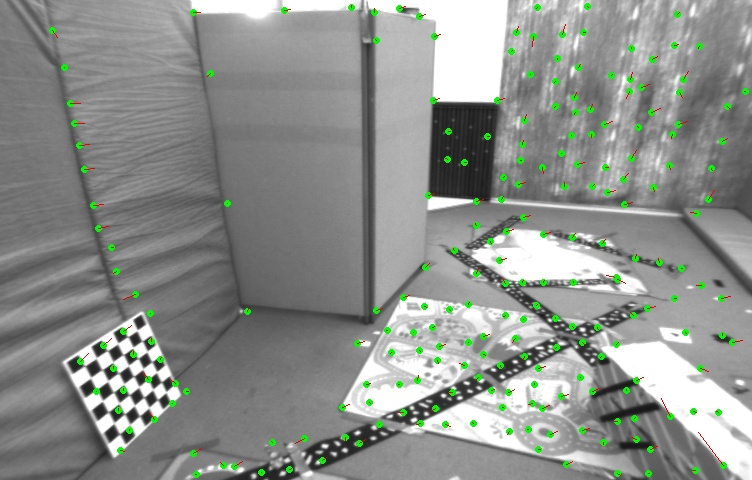

#### 4. 推广至金字塔

```cpp

void OpticalFlowMultiLevel(
        const Mat &img1,
        const Mat &img2,
        const vector<KeyPoint> &kp1,
        vector<KeyPoint> &kp2,
        vector<bool> &success,
        bool inverse) {

    // parameters
    int pyramids = 4;
    double pyramid_scale = 0.25;
    double scales[] = {1.0, 0.25, 0.0625, 0.015625};// {1.0, 0.5, 0.25, 0.125};

    // create pyramids
    vector<Mat> pyr1, pyr2; // image pyramids
    // TODO START YOUR CODE HERE (~8 lines)
    for (int i = 0; i < pyramids; i++) {
        Mat img1_temp, img2_temp;
        resize(img1, img1_temp, Size(img1.cols * scales[i], img1.rows * scales[i]));
        resize(img2, img2_temp, Size(img2.cols * scales[i], img2.rows * scales[i]));
        pyr1.push_back(img1_temp);
        pyr2.push_back(img2_temp);
        cout << "Pyramid: " << i << " img1 size: " << img1_temp.cols << " " << img1_temp.rows << endl;
    }
    // TODO END YOUR CODE HERE
    // coarse-to-fine LK tracking in pyramids
    // TODO START YOUR CODE HEREi
    vector<KeyPoint> vkp2_now;
    vector<KeyPoint> vkp2_last;
    vector<bool> vsucc;
    for (int i = pyramids - 1; i >= 0; i--) {
        vector<KeyPoint> vkp1;
        for (int j = 0; j < kp1.size(); j++) {
            KeyPoint kp1_temp = kp1[j];
            kp1_temp.pt *= scales[i];
            vkp1.push_back(kp1_temp);
            if (i < pyramids - 1) {
                KeyPoint kp2_temp = vkp2_last[j];
                kp2_temp.pt /= pyramid_scale;
                vkp2_now.push_back(kp2_temp);
            }
        }
        vsucc.clear();
        OpticalFlowSingleLevel(pyr1[i], pyr2[i], vkp1, vkp2_now, vsucc, inverse);
        vkp2_last.clear();
        vkp2_last.swap(vkp2_now);
        cout << "pyramid: " << i << " vkp2_last size: " << vkp2_last.size() << " vkp2_now size: " << vkp2_now.size()
             << endl;
    }
    kp2 = vkp2_last;
    success = vsucc;
    // TODO END YOUR CODE HERE
    // don't forget to set the results into kp2
}

```
正向输出结果：

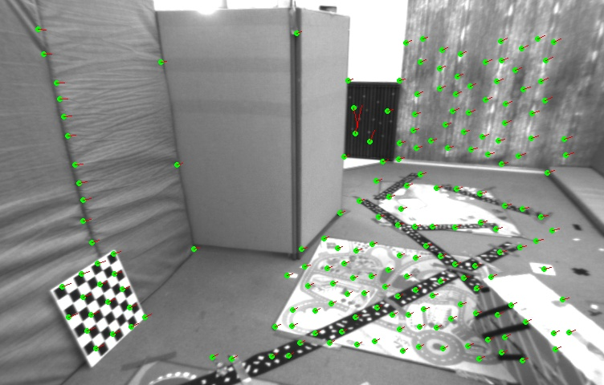

反向输出结果：


1. 所谓的coarse-to-fine是怎样的过程？

    所谓的由粗到精过程，就是将图片缩小后做单层光流法，然后再利用上一层的结果做下一层的初始值再做单层光流法的过程。这个方法能够奏效，主要原因是，单层光流法在微小移动时比较可靠。

2. 光流法中的金字塔用途和特征点法中的金字塔有什么区别？

    光流金字塔是为了防止因相机转动快导致的无法跟踪或跟踪效果差；特征点法中的金字塔是为了排除焦距影响，实现尺度不变性。

#### 5. 讨论

现在你已经自己实现了光流,看到了基于金字塔的 LK 光流能够与 OpenCV 达到相似的效果(甚至更好)。根据光流的结果,你可以和上讲一样,计算对极几何来估计相机运动。下面针对本次实验结果,谈谈你对下面问题的看法:

- 我们优化两个图像块的灰度之差真的合理吗?哪些时候不够合理?你有解决办法吗?

    我认为不是很合理。由于物体的材质问题，会出现高光和阴影; 同样相机有自动调节曝光参数，导致图像整体变亮或变暗。

    解决方法：小块的图像块做归一化处理，然后去均值，仅仅保留相对的像素变化值。 相对光度不变假设相比绝对光度不变假设更鲁棒一些。

- 图像块大小是否有明显差异?取 16x16 和 8x8 的图像块会让结果发生变化吗?

    下图是取 16× 16图像块的结果，就图像直观而言，图像块变大单层效果提升，对金字塔以及opencv效果没有太大差别。

  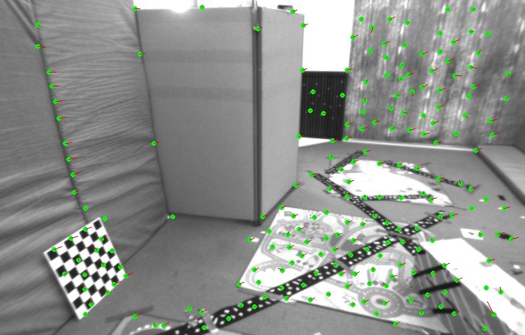

  

  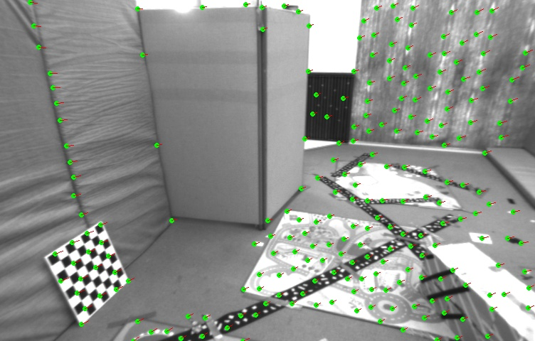

- 金字塔层数对结果有怎样的影响?缩放倍率呢?

    我们先看层数的影响。如下分别时2,4,6层的时候反向金字塔输出结果。

    

    

    

    由以上三张图片做对比可知，2层因为缩放不够，导致效果一般; 但是6层因为过于粗糙，导致很多特征点跟踪丢失，最终效果也不好。

    我们再看缩放倍率：
    我分别使用了是0.3, 0.5, 0.7的缩放倍率，同样的四层金字塔效果展示
    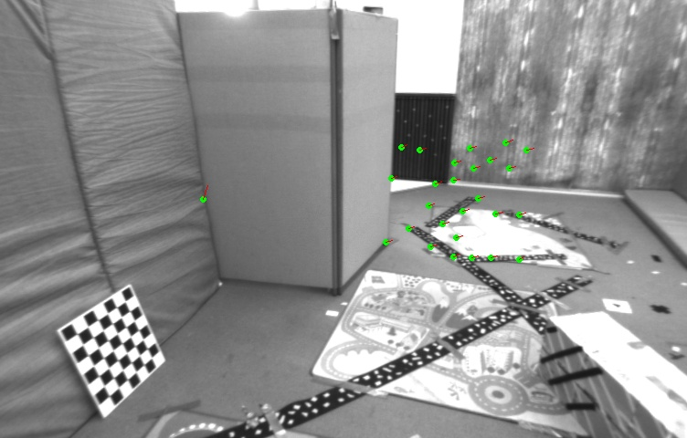

    

    

    从上面三张图片对比，可知采用0.3缩放倍率由于四层之后过于coarse，同样出现特征点丢失情况。而0.7和0.5缩放倍率效果基本相同。


## 二、直接法

#### 1. 单层直接法

直接法是光流法的直观拓展。光流中，我们估计的是每个像素的平移，在直接法中，我们最小化光流误差，估计相机的旋转和平移。现在我们使用与第一题很相似的做法来实现直接法，同学们体会二者的联系。

本习题首先给定Kitti数据集中的一些图像，给定left.png和disparity.png，可以得到left.png图像中任意一点的3D信息。我们将left.png称为ref（参考），1-5.png称为cur（当前），设待估计的目标为T_cur,ref。在ref中取一组点{pi}，位姿可以通过最小化下面的目标函数求解：

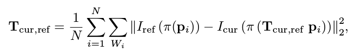

回答下列问题并实现DirectPoseEs-timationSingleLayer 函数。

1. 该问题的误差项是什么？

    该问题的误差项与光流法一样，都是求两个图像对应点之间的灰度差。

2. 误差相对于自变量的雅克比维度是多少？ 如何求解？

    雅克比维度为1×6, 求解的时候先和光流法一样求一个像素梯度1×2，然后在求一个三维点对变换的导数2×6，然后两者相称，生成最终的雅克比矩阵。

3. 窗口可以取多大？是否可以取单个点？

    同一个窗口采用相同的深度信息，取太大会有误差; 而且窗口太大，运算量成倍增长，建议根据实际情况酌情选取窗口大小。

  可以取单个点，只是最终运算结果会有较大的误差。

  如下图所示：

  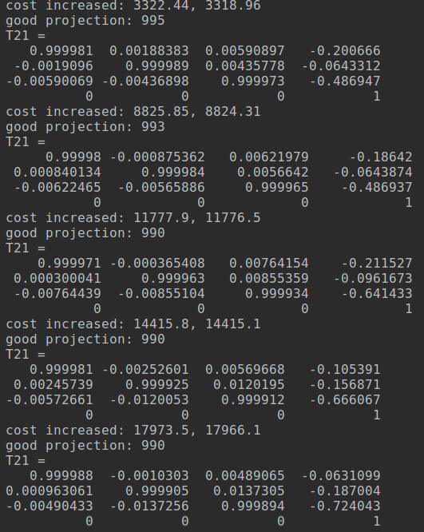

代码实现：

```cpp

void DirectPoseEstimationSingleLayer(
        const cv::Mat &img1,
        const cv::Mat &img2,
        const VecVector2d &px_ref,
        const vector<double> depth_ref,
        Sophus::SE3 &T21
) {

    // parameters
    int half_patch_size = 4;
    int iterations = 100;

    double cost = 0, lastCost = 0;
    int nGood = 0;  // good projections 最后求平均误差用这个标记在图像内的点
    VecVector2d goodProjection;

    for (int iter = 0; iter < iterations; iter++) {
        nGood = 0;
        goodProjection.clear();

        // Define Hessian and bias
        Matrix6d H = Matrix6d::Zero();  // 6x6 Hessian
        Vector6d b = Vector6d::Zero();  // 6x1 bias

        for (size_t i = 0; i < px_ref.size(); i++) {

            // compute the projection in the second image
            // TODO START YOUR CODE HERE
            float u =0, v = 0;
            //cout << "第一图：x：" << px_ref[i][0] << "第2图：y：" << px_ref[i][1] << endl;
            float x, y, z;
            float X, Y,Z, Z_2;
            z = (float)depth_ref[i];
            x = (px_ref[i][0]-cx)*z/fx;
            y = (px_ref[i][1]-cy)*z/fy;
            Eigen::Vector3d point3d = {x, y, z};
            Eigen::Vector3d point_rotation;
            point_rotation = T21 * point3d;
            X = point_rotation[0];
            Y = point_rotation[1];
            Z = point_rotation[2];
            u = (X*fx/Z + cx);
            v = (Y*fy/Z + cy);
            //cout << "u: " << u << "v: " << v << endl;
            Z_2 = Z * Z;

            if (u < half_patch_size || u >= (img2.cols-half_patch_size) ||
            v < half_patch_size || v >= (img2.rows-half_patch_size)){
                continue;
            }
            nGood++;
            goodProjection.push_back(Eigen::Vector2d(u, v));
            // and compute error and jacobian
            for (int x = -half_patch_size; x < half_patch_size; x++)
                for (int y = -half_patch_size; y < half_patch_size; y++) {
                    float u1,v1,u2,v2;
                    double error =0;
                    u1 = px_ref[i][0] + x;
                    v1 = px_ref[i][1] + y;
                    u2 = u + x;
                    v2 = v + y;
                    error =GetPixelValue(img1,u1, v1) - GetPixelValue(img2,u2,v2);
                    if (u2+1>=img2.cols || u2-1<0 || v2+1>=img2.rows || v2-1<0){
                        continue;
                    }
                    Eigen::Vector2d J_img_pixel;    // image gradients
                    Matrix26d J_pixel_xi;   // pixel to \xi in Lie algebra
                    J_pixel_xi <<-(fx/Z), 0, fx*X/Z_2,  fx*X*Y/Z_2, -(fx+fx*X*X/Z_2), fx*Y/Z,
                            0, -fy/Z, fy*Y/Z_2,fy+fy*Y*Y/Z_2, -fy*X*Y/Z_2, -fy*X/Z;
                    J_img_pixel[0] = (GetPixelValue(img2,u2+1,v2) - GetPixelValue(img2,u2-1,v2))/2; // de/dx
                    J_img_pixel[1] = (GetPixelValue(img2,u2,v2+1) - GetPixelValue(img2,u2,v2-1))/2; // de/dy
                    Vector6d J;
                    J_pixel_xi = - J_pixel_xi;
                    J = -J_pixel_xi.transpose() * J_img_pixel;
                    H += J * J.transpose();
                    b += -error * J;
                    cost += error * error;
                }
            // END YOUR CODE HERE
        }

        // solve update and put it into estimation
        // TODO START YOUR CODE HERE
        Vector6d update;
        update = H.ldlt().solve(b);
        T21 = Sophus::SE3::exp(update) * T21;
        // END YOUR CODE HERE

        cost /= nGood;

        if (isnan(update[0])) {
            // sometimes occurred when we have a black or white patch and H is irreversible
            cout << "update is nan" << endl;
            break;
        }
        if (iter > 0 && cost > lastCost) {
            cout << "cost increased: " << cost << ", " << lastCost << endl;
            break;
        }
        lastCost = cost;
        // cout << "cost = " << cost << ", good = " << nGood << endl;
    }
    cout << "good projection: " << nGood << endl;
    cout << "T21 = \n" << T21.matrix() << endl;

    // in order to help you debug, we plot the projected pixels here
    cv::Mat img1_show, img2_show;
    cv::cvtColor(img1, img1_show, CV_GRAY2BGR);
    cv::cvtColor(img2, img2_show, CV_GRAY2BGR);
    for (auto &px: px_ref) {
        cv::rectangle(img1_show, cv::Point2f(px[0] - 2, px[1] - 2), cv::Point2f(px[0] + 2, px[1] + 2),
                      cv::Scalar(0, 250, 0));
    }
    for (auto &px: goodProjection) {
        cv::rectangle(img2_show, cv::Point2f(px[0] - 2, px[1] - 2), cv::Point2f(px[0] + 2, px[1] + 2),
                      cv::Scalar(0, 250, 0));
    }
    cv::imshow("reference", img1_show);
    cv::imshow("current", img2_show);
    cv::waitKey();
}

```
输出结果：

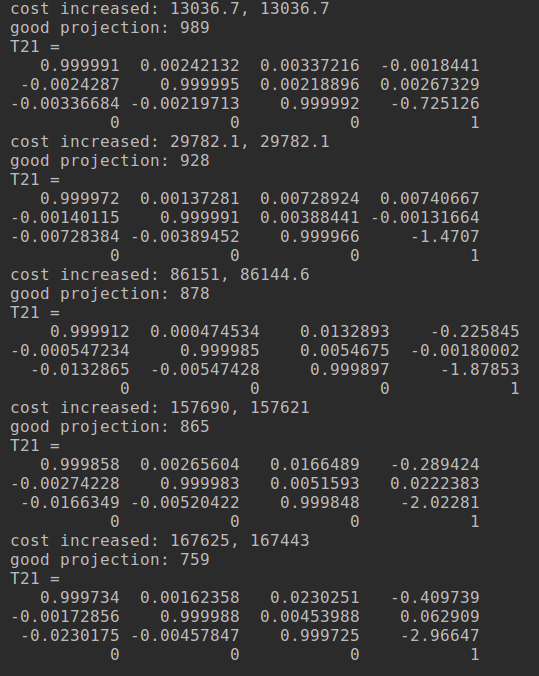

平移部分与实际相符，证明代码没问题。

图像跟踪结果（ref与第五张做对比）：

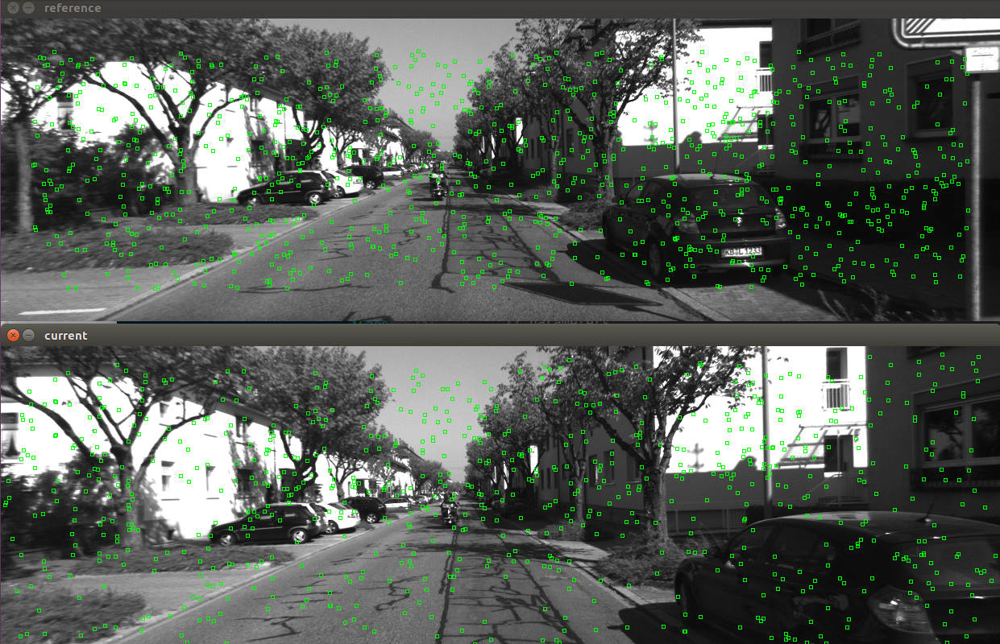

#### 2. 多层直接法

代码部分：

```cpp

void DirectPoseEstimationMultiLayer(
        const cv::Mat &img1,
        const cv::Mat &img2,
        const VecVector2d &px_ref,
        const vector<double> depth_ref,
        Sophus::SE3 &T21
) {

    // parameters
    int pyramids = 4;
    double pyramid_scale = 0.5;
    double scales[] = {1.0, 0.5, 0.25, 0.125};

    // create pyramids
    vector<cv::Mat> pyr1, pyr2; // image pyramids
    // TODO START YOUR CODE HERE
    Mat img1_temp, img2_temp;
    for (int i = 0; i < pyramids; i++) {
        resize(img1, img1_temp, Size(img1.cols*scales[i],img1.rows*scales[i]));
        resize(img2, img2_temp, Size(img2.cols*scales[i],img2.rows*scales[i]));
        pyr1.push_back(img1_temp);
        pyr2.push_back(img2_temp);
    }
    // END YOUR CODE HERE

    double fxG = fx, fyG = fy, cxG = cx, cyG = cy;  // backup the old values
    for (int level = pyramids - 1; level >= 0; level--) {
        VecVector2d px_ref_pyr; // set the keypoints in this pyramid level
        for (auto &px: px_ref) {
            px_ref_pyr.push_back(scales[level] * px);
        }

        // TODO START YOUR CODE HERE
        // scale fx, fy, cx, cy in different pyramid levels
        fx = fxG * scales[level];
        fy = fyG * scales[level];
        cx = cxG * scales[level];
        cy = cyG * scales[level];
        // END YOUR CODE HERE
        DirectPoseEstimationSingleLayer(pyr1[level], pyr2[level], px_ref_pyr, depth_ref, T21);
    }
}
```

终端输出结果：

这里只展示第五张图的输出结果。可以看出多层效果要更接近参考答案，更准确。
```
good projection: 580
T21 =
   0.999811  0.00196353   0.0193374   0.0332446
-0.00208745    0.999977  0.00639022 -0.00596133
 -0.0193244 -0.00642938    0.999793    -3.79251
          0           0           0           1
cost increased: 77188, 77083.7
good projection: 639
T21 =
    0.99981  0.00212856   0.0193568   0.0393446
-0.00224531    0.999979  0.00601174  0.00471207
 -0.0193436 -0.00605406    0.999795     -3.8376
          0           0           0           1
cost increased: 76448.1, 76436.8
good projection: 660
T21 =
   0.999806  0.00136695   0.0196532    0.041096
-0.00148369    0.999981  0.00592668  0.00573318
 -0.0196448 -0.00595469    0.999789    -3.82921
          0           0           0           1
cost increased: 90542.8, 90539.8
good projection: 677
T21 =
   0.999803   0.0012019   0.0198238   0.0189153
-0.00133153    0.999978  0.00652719  -0.0102467
 -0.0198155  -0.0065523    0.999782      -3.793
          0           0           0           1
```

第五张图片的底层金字塔对比图：

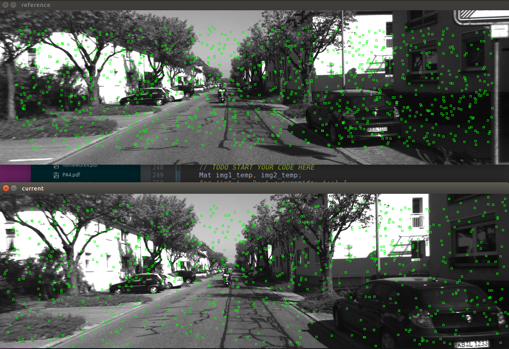


#### 3. 延伸讨论

1. 直接法是否可以类似光流，提出inverse,compositional的概念，有意义吗？

    做当然可以做，但是没有意义。我们这里求的是current图像的u，v的像素梯度，这里的uv，不再向光流那样通过dx，dy来更新，而是直接通过R,t旋转平移得到的。所以我不认为inverse,compositional的概念在直接法中有意义。

2. 思考上面算法哪些地方可以缓存或加速？

在选取窗口上可以考虑使用合适大小的窗口。

减少跟踪点也是一种方法。

因为深度不变，在小窗口中每次计算的三维点对变换的导数部分会重复计算，可以提到循环外面来加速运算。

3. 在上述过程中，我们实际假设了哪两个patch不变？

    第一： 窗口大小不变8×8

    第二： 窗口内深度不变


4. 为什么可以随机取点？而不用取角点或线上的点？那些不是角点的地方，投影算对了吗？

直接法是灰度不变假设，跟是否选取角点关系不是很大。当然如果我们用角点做跟踪，也是可以的。因为角点处往往有明显的灰度梯度。

从最终效果图中看， 不是角点的地方，也基本没问题。因为所有的点其实是个整体，共同为R和t负责。

5. 总结直接法相对于特征点法的异同与优缺点。


算法 | 优点 | 缺点
---|---|---
直接法 |  1. 可以省去计算特征点、描述子的时间。只要求有像素梯度即可，无须特征点。因此，直接法可以在特征缺失的场合下使用。 2.比较极端的例子只有渐变的一张图像。它可能无法提取角点类特征，但可以用直接法估计它的运动。3.可以构建半稠密乃至稠密的地图，这是特征点法无法做到的。 | 1. 非凸性——直接法完全依靠梯度搜索，降低目标函数来计算相机位姿。其目标函数中需要取像素点的灰度值，而图像是强烈非凸的函数。这使得优化算法容易进入极小，只在运动很小时直接法才能成功。  2. 单个像素没有区分度。找一个和他像的实在太多了！——于是我们要么计算图像块，要么计算复杂的相关性。由于每个像素对改变相机运动的“意见”不一致。只能少数服从多数，以数量代替质量。  3. 灰度值不变是很强的假设。如果相机是自动曝光的，当它调整曝光参数时，会使得图像整体变亮或变暗。光照变化时亦会出现这种情况。特征点法对光照具有一定的容忍性，而直接法由于计算灰度间的差异，整体灰度变化会破坏灰度不变假设，使算法失败
特征点法|1.对光照有一定容忍度    2. 只要图像中还有匹配点，就不容易丢失，有更好的鲁棒性 | 1. 当环境特征点少的时候，容易失败;    2. 特征点集中的时候，容易退化，相机运动快，容易丢失； 3. 而且计算特征点，计算描述子，以及描述子的匹配都是费力气的大活，消耗计算资源。


## 三、使用光流计算视差

在上一题中我们已经实现了金字塔 LK 光流。光流有很多用途,它给出了两个图像中点的对应关系,所
以我们可以用光流进行位姿估计,或者计算双目的视差。回忆第四节课的习题中,我们介绍了双目可以通过
视差图得出点云,但那时直接给出了视差图,而没有进行视差图的计算。现在,给定图像 left.png, right.png,
请你使用上题的结果,计算 left.png 中的 GFTT 点在 right.png 中的(水平)视差,然后与 disparity.png
进行比较。这样的结果是一个稀疏角点组成的点云。请计算每个角点的水平视差,然后对比视差图比较结
果。

本程序不提供代码框架,请你根据之前习题完成此内容。


分析题目：
代码主要流程是，首先利用光流法，求出左图中的keypoint在右图中的位置，然后将对应点的u做差。最后跟disparity中的real数据做对比。

代码部分：

```cpp

#include <opencv2/opencv.hpp>
#include <string>
#include <Eigen/Core>
#include <Eigen/Dense>

using namespace std;
using namespace cv;

// this program shows how to use optical flow

string file_1 = "../left.png";  // first image
string file_2 = "../right.png";  // second image
string file_3 = "../disparity.png";
// TODO implement this funciton
/**
 * single level optical flow
 * @param [in] img1 the first image
 * @param [in] img2 the second image
 * @param [in] kp1 keypoints in img1
 * @param [in|out] kp2 keypoints in img2, if empty, use initial guess in kp1
 * @param [out] success true if a keypoint is tracked successfully 针对每个keypoint做处理
 * @param [in] inverse use inverse formulation? 根据这个参数分别完成正向和反向两个函数
 */
void OpticalFlowSingleLevel(
        const Mat &img1,
        const Mat &img2,
        const vector<KeyPoint> &kp1,
        vector<KeyPoint> &kp2,
        vector<bool> &success,
        bool inverse = false
);

// TODO implement this funciton
/**
 * multi level optical flow, scale of pyramid is set to 2 by default
 * the image pyramid will be create inside the function
 * @param [in] img1 the first pyramid
 * @param [in] img2 the second pyramid
 * @param [in] kp1 keypoints in img1
 * @param [out] kp2 keypoints in img2
 * @param [out] success true if a keypoint is tracked successfully
 * @param [in] inverse set true to enable inverse formulation
 */
void OpticalFlowMultiLevel(
        const Mat &img1,
        const Mat &img2,
        const vector<KeyPoint> &kp1,
        vector<KeyPoint> &kp2,
        vector<bool> &success,
        bool inverse = false
);

/**
 * get a gray scale value from reference image (bi-linear interpolated)双线性插值获得浮点的像素值
 * @param img
 * @param x
 * @param y
 * @return
 */
inline float GetPixelValue(const cv::Mat &img, float x, float y) {
    uchar *data = &img.data[int(y) * img.step + int(x)];
    float xx = x - floor(x);
    float yy = y - floor(y);
    return float(
            (1 - xx) * (1 - yy) * data[0] +
            xx * (1 - yy) * data[1] +
            (1 - xx) * yy * data[img.step] +
            xx * yy * data[img.step + 1]
    );
}


int main(int argc, char **argv) {

    // images, note they are CV_8UC1, not CV_8UC3 灰度图单通道
    Mat img1 = imread(file_1, 0);
    Mat img2 = imread(file_2, 0);
    Mat img3 = imread(file_3, 0);
    // key points, using GFTT here.
    vector<KeyPoint> kp1;
    Ptr<GFTTDetector> detector = GFTTDetector::create(500, 0.01, 20); // maximum 500 keypoints
    detector->detect(img1, kp1);

    // now lets track these key points in the second image
    vector<KeyPoint> kp2_single;
    vector<bool> success_single;
    OpticalFlowSingleLevel(img1, img2, kp1, kp2_single, success_single, true);

    // then test multi-level LK
    vector<KeyPoint> kp2_multi;
    vector<bool> success_multi;
    OpticalFlowMultiLevel(img1, img2, kp1, kp2_multi, success_multi,true);

    // use opencv's flow for validation
    vector<Point2f> pt1, pt2;
    for (auto &kp: kp1) pt1.push_back(kp.pt);
    vector<uchar> status;
    vector<float> error;
    cv::calcOpticalFlowPyrLK(img1, img2, pt1, pt2, status, error, cv::Size(8, 8));

    int count=0, count1=0, count2=0, count3=0, count4=0;

    // plot the differences of those functions
    Mat img2_single;
    cv::cvtColor(img2, img2_single, CV_GRAY2BGR);
    for (int i = 0; i < kp2_single.size(); i++) {
        if (success_single[i]) {
            cv::circle(img2_single, kp2_single[i].pt, 2, cv::Scalar(0, 250, 0), 2);
            cv::line(img2_single, kp1[i].pt, kp2_single[i].pt, cv::Scalar(0, 0, 230));

            int iDisparity = img3.at<uchar>(kp1[i].pt.y, kp1[i].pt.x);
            int iOptFlowDisparity = kp1[i].pt.x - kp2_multi[i].pt.x;
            int iDeltaDisp = abs(iOptFlowDisparity - iDisparity);
            count++;
            if (iDeltaDisp <=5){
                count1++;
            } else if(iDeltaDisp <= 10){
                count2++;
            }else if(iDeltaDisp <=20){
                count3++;
            } else{
                count4 ++;
            }
        }
    }
    cout<<"单层光流法：" <<"\n 共有：" << count << "个！"<<"\n [0, 5]: "<<count1 <<"\n (5,10]: "<<count2<<"\n (10,20]: "<<count3<<"\n [20,++): "<<count4<<endl;

    count=0, count1=0, count2=0, count3=0, count4=0;

    Mat img2_multi;
    cv::cvtColor(img2, img2_multi, CV_GRAY2BGR);
    for (int i = 0; i < kp2_multi.size(); i++) {
        if (success_multi[i]) {
            cv::circle(img2_multi, kp2_multi[i].pt, 2, cv::Scalar(0, 250, 0), 2);
            cv::line(img2_multi, kp1[i].pt, kp2_multi[i].pt, cv::Scalar( 0, 0, 230));

            int iDisparity = img3.at<uchar>(kp1[i].pt.y, kp1[i].pt.x);
            int iOptFlowDisparity = kp1[i].pt.x - kp2_multi[i].pt.x;
            int iDeltaDisp = abs(iOptFlowDisparity - iDisparity);
            count++;
            if (iDeltaDisp <=5){
                count1++;
            } else if(iDeltaDisp <= 10){
                count2++;
            }else if(iDeltaDisp <=20){
                count3++;
            } else{
                count4 ++;
            }
        }
    }
    cout<<"四层金字塔光流法：" <<"\n 共有：" << count << "个！"<<"\n [0, 5]: "<<count1 <<"\n (5,10]: "<<count2<<"\n (10,20]: "<<count3<<"\n [20,++): "<<count4<<endl;

    count=0, count1=0, count2=0, count3=0, count4=0;

    Mat img2_CV;
    cv::cvtColor(img2, img2_CV, CV_GRAY2BGR);
    for (int i = 0; i < pt2.size(); i++) {
        if (status[i]) {
            cv::circle(img2_CV, pt2[i], 2, cv::Scalar(0, 250, 0), 2);
            cv::line(img2_CV, pt1[i], pt2[i], cv::Scalar(0, 0, 230));


            int iDisparity = img3.at<uchar>(kp1[i].pt.y, kp1[i].pt.x);
            int iOptFlowDisparity = kp1[i].pt.x - kp2_multi[i].pt.x;
            int iDeltaDisp = abs(iOptFlowDisparity - iDisparity);
            count++;
            if (iDeltaDisp <=5){
                count1++;
            } else if(iDeltaDisp <= 10){
                count2++;
            }else if(iDeltaDisp <=20){
                count3++;
            } else{
                count4 ++;
            }
        }
    }

    cout<<"opencv的光流法：" <<"\n 共有：" << count << "个！"<<"\n [0, 5]: "<<count1 <<"\n (5,10]: "<<count2<<"\n (10,20]: "<<count3<<"\n [20,++): "<<count4<<endl;

    cv::imshow("tracked single level", img2_single);
    cv::imshow("tracked multi level", img2_multi);
    cv::imshow("tracked by opencv", img2_CV);
    cv::waitKey(0);
    cv::imwrite("/home/xbot/VSLAM_Homework/ch6/image/multi_cal.jpg",img2_multi);
    cv::imwrite("/home/xbot/VSLAM_Homework/ch6/image/single_cal.jpg",img2_single);
    cv::imwrite("/home/xbot/VSLAM_Homework/ch6/image/opencv_cal.jpg",img2_CV);
    return 0;
}

void OpticalFlowSingleLevel(
        const Mat &img1,
        const Mat &img2,
        const vector<KeyPoint> &kp1,
        vector<KeyPoint> &kp2,
        vector<bool> &success,
        bool inverse
) {
    // parameters
    int half_patch_size = 4;
    int iterations = 10;
    bool have_initial = !kp2.empty();

    for (size_t i = 0; i < kp1.size(); i++) {
        auto kp = kp1[i];
        double dx = 0, dy = 0; // dx,dy need to be estimated
        if (have_initial) {
            dx = kp2[i].pt.x - kp.pt.x;
            dy = kp2[i].pt.y - kp.pt.y;
        }

        double cost = 0, lastCost = 0;
        bool succ = true; // indicate if this point succeeded

        // Gauss-Newton iterations
        for (int iter = 0; iter < iterations; iter++) {
            Eigen::Matrix2d H = Eigen::Matrix2d::Zero();
            Eigen::Vector2d b = Eigen::Vector2d::Zero();
            cost = 0;

            // 检查是否在边缘
            if (kp.pt.x + dx <= half_patch_size || kp.pt.x + dx >= img1.cols - half_patch_size ||
                kp.pt.y + dy <= half_patch_size || kp.pt.y + dy >= img1.rows - half_patch_size) {   // go outside
                succ = false;
                break;
            }

            // compute cost and jacobian  x和y都是[-4,3]
            for (int x = -half_patch_size; x < half_patch_size; x++)
                for (int y = -half_patch_size; y < half_patch_size; y++) {
                    // TODO START YOUR CODE HERE (~8 lines)
                    float u1, v1, u2, v2;
                    u1 = kp.pt.x + x;
                    u2 = u1 + dx;
                    v1 = kp.pt.y + y;
                    v2 = v1 + dy;
                    double error = 0;
                    error = GetPixelValue(img2,u2,v2)-GetPixelValue(img1,u1, v1);
                    Eigen::Vector2d J;  // Jacobian
                    // 这里是对dx，dy求导
                    if (inverse == false) {
                        // Forward Jacobian
                        J[0] = (GetPixelValue(img2,u2+1,v2) - GetPixelValue(img2,u2-1,v2))/2; // de/dx
                        J[1] = (GetPixelValue(img2,u2,v2+1) - GetPixelValue(img2,u2,v2-1))/2; // de/dy
                    } else {
                        // Inverse Jacobian
                        // NOTE this J does not change when dx, dy is updated, so we can store it and only compute error
                        J[0] = (GetPixelValue(img1,u1+1,v1) - GetPixelValue(img1,u1-1,v1))/2; // de/dx
                        J[1] = (GetPixelValue(img1,u1,v1+1) - GetPixelValue(img1,u1,v1-1))/2; // de/dy
                    }
                    // compute H, b and set cost;
                    H += J * J.transpose();
                    b += -error * J ;
                    cost += error * error;
                }

            // compute update
            Eigen::Vector2d update;
            update = H.ldlt().solve(b);

            if (isnan(update[0])) {
                // sometimes occurred when we have a black or white patch and H is irreversible
                cout << "update is nan" << endl;
                succ = false;
                break;
            }
            if (iter > 0 && cost > lastCost) {
                cout << "cost increased: " << cost << ", " << lastCost << endl;
                break;
            }

            // update dx, dy
            dx += update[0];
            dy += update[1];
            lastCost = cost;
            succ = true;
        }

        success.push_back(succ);


        if (have_initial) {
            kp2[i].pt = kp.pt + Point2f(dx, dy);
        } else {
            KeyPoint tracked = kp;
            tracked.pt += cv::Point2f(dx, dy);
            kp2.push_back(tracked);
        }
    }
}

void OpticalFlowMultiLevel(
        const Mat &img1,
        const Mat &img2,
        const vector<KeyPoint> &kp1,
        vector<KeyPoint> &kp2,
        vector<bool> &success,
        bool inverse) {

    // parameters
    int pyramids = 4;
    double pyramid_scale = 0.5;
    double scales[] = {1.0, 0.5, 0.25, 0.125};

    // create pyramids
    vector<Mat> pyr1, pyr2; // image pyramids 注意这里是个vector
    Mat img1_temp, img2_temp;
    for (int i = 0; i < pyramids; i++) {
        resize(img1, img1_temp, Size(img1.cols*scales[i],img1.rows*scales[i]));
        resize(img2, img2_temp, Size(img2.cols*scales[i],img2.rows*scales[i]));
        pyr1.push_back(img1_temp);
        pyr2.push_back(img2_temp);
    }
    // coarse-to-fine LK tracking in pyramids
    // 这里的关键：上一层的估计值做下一层的初始值

    vector<KeyPoint> kp1_pyr, kp2_pyr, kp2_temp;
    for (int m = pyramids-1; m >= 0; --m) {
        img1_temp = pyr1[m];
        img2_temp = pyr2[m];

        for (auto kp: kp1){
            kp.pt *= scales[m];
            kp1_pyr.push_back(kp);
        }
        OpticalFlowSingleLevel(img1_temp, img2_temp,kp1_pyr,kp2_temp,success, inverse);
        kp1_pyr.clear();

        if (m){
            kp2_pyr.clear();
            for (auto kp: kp2_temp){
                kp.pt /= pyramid_scale;
                kp2_pyr.push_back(kp);
            }
            kp2_temp = kp2_pyr;
        }
    }
    kp2 = kp2_pyr;

}


```

输出结果：
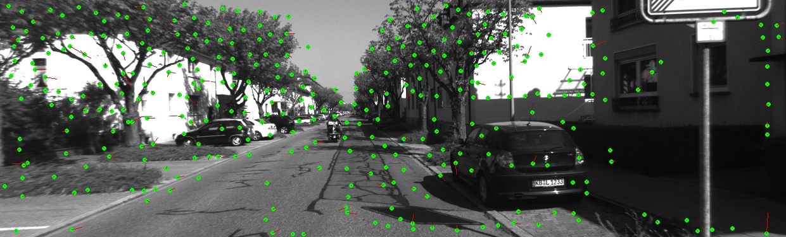
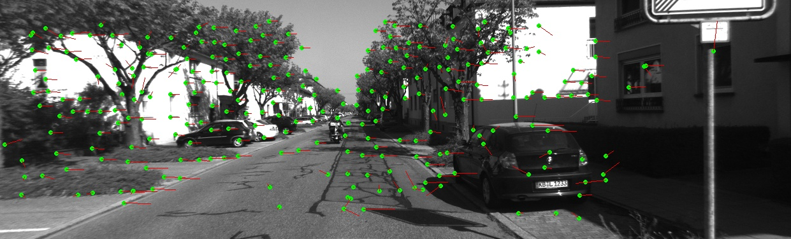
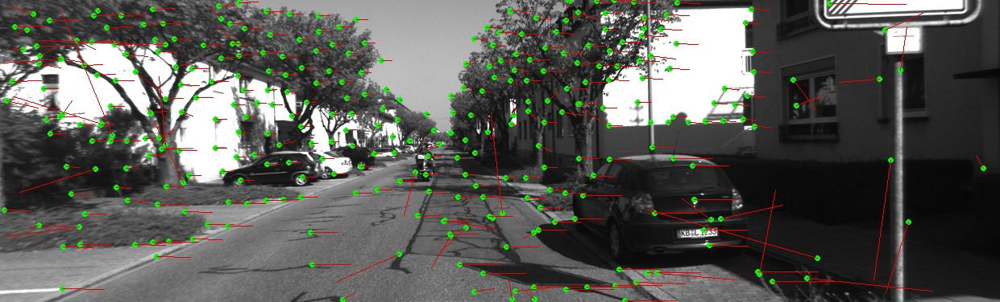


与真实的视差数据做差取绝对值后，统计结果如下：

```
单层光流法：
 共有：352个！
 [0, 5]: 182
 (5,10]: 14
 (10,20]: 40
 [20,++): 116
四层金字塔光流法：
 共有：274个！
 [0, 5]: 177
 (5,10]: 11
 (10,20]: 31
 [20,++): 55
opencv的光流法：
 共有：333个！
 [0, 5]: 180
 (5,10]: 14
 (10,20]: 39
 [20,++): 100
```

从统计结果来看，四层光流法效果最好。单层最差。

从图像效果来看，中间部分往往效果要好，越是边缘越不精确。
