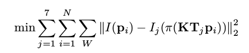

## 一、Bundle Adjustment

#### 1. 文献阅读
阅读Bill Triggs经典论文Bundle Adjustment: A Modern Synthesis, 了解BA的发展历史，回答下列问题

1. 为何说BA is slow 是不对的？

2. BA中有那些需要注意参数化的地方？ Pose和Point各有哪些参数化方式？有何优缺点？

3. 本文写于 2000 年,但是文中提到的很多内容在后面十几年的研究中得到了印证。你能看到哪些
方向在后续工作中有所体现?请举例说明。

#### 2. BAL-dataset

BAL(Bundle Adjustment in large)数据集(http://grail.cs.washington.edu/projects/bal/)
是一个大型 BA 数据集,它提供了相机与点初始值与观测,你可以用它们进行 Bundle Adjustment。现在,
请你使用 g2o,自己定义 Vertex 和 Edge(不要使用自带的顶点类型,也不要像本书例程那边调用 Ceres
来求导),书写 BAL 上的 BA 程序。你可以挑选其中一个数据,运行你的 BA,并给出优化后的点云图。

**提示：**
注意BAL的投影模型比教材中介绍的多了负号。


代码部分：
```cpp

```

结果验证：

## 二、直接法的BA

#### 1. 数学模型

特征点法的BA以最小化重投影误差为目标，相对的，如果我们以最小化光度误差为目标，就得到了直接法的BA。之前我们在直接法VO中，谈到如何用直接法去估计相机位姿。但是直接法也可以处理整个BA。

下面，请你推到直接法BA的数学模型，完成g2o的实现。

注意：我们用x,y,z参数化每个3D点，而实际的直接法多采用逆深度参数化。使用逆深度会有一种类似归一化的效果，防止因为距离太远，导致对其他参数不敏感。

本题给定7张照片，每张图片对应相机位姿初始值为Ti, 以Tcw存储在poses.txt文件中，其中每一行代表一个相机位姿，格式同之前一致。
同时，还有一个3D点集P, 共N个点。其中每个点的初始坐标基座pi. 每个带你都有自己的固定灰度值，16个该点周围4×4小块读数表示，顺序是列优先。

我们知道，可以把每个点投影到每个图像上，然后再看投影后点周围的小块与原始的4×4小块的差别。那么，整体优化目标函数如下：



也就是最小化任意点在任意图像中投影与其本身颜色之差。其中K是相机内参，pi是投影函数，W是整个patch。下面请回答：
1. 如何描述任意一点投影在任意一张图像中的error？
2. 每个error关联几个优化变量？
3. error关于各变量的雅克比是什么？


#### 2. 实现

根据上面说明，使用g2o实现上述优化。用pangolin绘制优化结果。 同时思考并回答如下问题：

1. 能否不用[x,y,z]形式参数化每个点？
2. patch的大小选取有什么说法？
3. 从本题中，你看到直接法跟特征点法在BA阶段有何不同？
4. 由于图像的差异，你可能需要鲁棒核函数，例如Huber。那Huber的阈值怎么选取?
