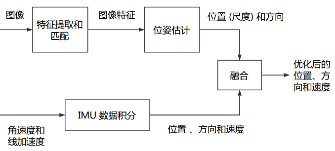
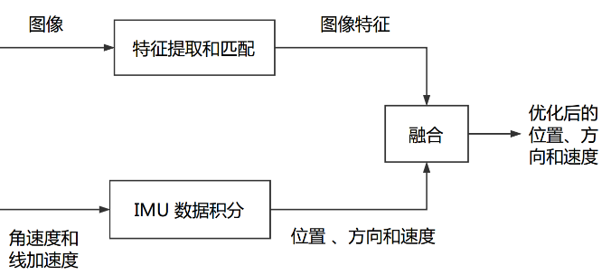

# VIO的Bundle adjustment推导


在 VIO 里,除了传统的 bundle adjustment 以外,我们还有 IMU 提供的测量量。请
根据文献 [1],推导并实现带有 IMU 测量的 Bundle Adjustment。以下是一些提示:

1. 首先,请推导 IMU 测量方程,即角速度和加速度分别测到的是什么量。这其中
需要用到相机的运动学,请一并推导。

2. 第二,请说明按照图优化的思路,如何建立 VIO 的图模型?其中包括哪些节点
和边?

3. 第三,说明各节点储存的量是什么,各边的误差如何计算,雅可比如何计算?

4. 最后,利用 Ceres、g2o 或 gtsam 等库实现这些运算。

你也可以参考其他文献来回答这些问题。请注意 VIO 中的数学符号比较多,请使用一致
的符号。

## 一、选题说明

#### 1. 选题原因：

仅VSLAM使用环境有限，实际应用中，往往需要其他传感器配合使用。IMU传感器以其本身与相机互补的特性在当前广受欢迎。应用领域也非常广泛。在手机AR,VR等领域都有丰富的应用。

本次作业，选择VIO做最后的大作业，希望能够完整的整理VIO的知识，尤其是后端优化部分。

主要的参考是：VINSMONO，通过阅读VINS-MONO论文与相应代码，学习紧耦合方式的后端优化方法。

#### 2. VIO相关背景知识：
松耦合的融合方案：



紧耦合的融合方案：



#### 3. 代码框架和数据来源

1. IMU仿真数据

2. 实验测试数据

3. 整个VIO后端框架

#### 4. 本次大作业的工作内容


## 二、IMU的测量方程

#### 1.

视觉
```cpp

void EdgeReprojection::ComputeResidual() {
//    std::cout << pts_i_.transpose() <<" "<<pts_j_.transpose()  <<std::endl;

    double inv_dep_i = verticies_[0]->Parameters()[0];

    VecX param_i = verticies_[1]->Parameters();
    Qd Qi(param_i[6], param_i[3], param_i[4], param_i[5]);
    Vec3 Pi = param_i.head<3>();

    VecX param_j = verticies_[2]->Parameters();
    Qd Qj(param_j[6], param_j[3], param_j[4], param_j[5]);
    Vec3 Pj = param_j.head<3>();

    VecX param_ext = verticies_[3]->Parameters();
    Qd qic(param_ext[6], param_ext[3], param_ext[4], param_ext[5]);
    Vec3 tic = param_ext.head<3>();

    Vec3 pts_camera_i = pts_i_ / inv_dep_i;
    Vec3 pts_imu_i = qic * pts_camera_i + tic;
    Vec3 pts_w = Qi * pts_imu_i + Pi;
    Vec3 pts_imu_j = Qj.inverse() * (pts_w - Pj);
    Vec3 pts_camera_j = qic.inverse() * (pts_imu_j - tic);

    double dep_j = pts_camera_j.z();
    residual_ = (pts_camera_j / dep_j).head<2>() - pts_j_.head<2>();   /// J^t * J * delta_x = - J^t * r
//    residual_ = information_ * residual_;   // remove information here, we multi information matrix in problem solver
}

//void EdgeReprojection::SetTranslationImuFromCamera(Eigen::Quaterniond &qic_, Vec3 &tic_) {
//    qic = qic_;
//    tic = tic_;
//}

void EdgeReprojection::ComputeJacobians() {
    double inv_dep_i = verticies_[0]->Parameters()[0];

    VecX param_i = verticies_[1]->Parameters();
    Qd Qi(param_i[6], param_i[3], param_i[4], param_i[5]);
    Vec3 Pi = param_i.head<3>();

    VecX param_j = verticies_[2]->Parameters();
    Qd Qj(param_j[6], param_j[3], param_j[4], param_j[5]);
    Vec3 Pj = param_j.head<3>();

    VecX param_ext = verticies_[3]->Parameters();
    Qd qic(param_ext[6], param_ext[3], param_ext[4], param_ext[5]);
    Vec3 tic = param_ext.head<3>();

    Vec3 pts_camera_i = pts_i_ / inv_dep_i;
    Vec3 pts_imu_i = qic * pts_camera_i + tic;
    Vec3 pts_w = Qi * pts_imu_i + Pi;
    Vec3 pts_imu_j = Qj.inverse() * (pts_w - Pj);
    Vec3 pts_camera_j = qic.inverse() * (pts_imu_j - tic);

    double dep_j = pts_camera_j.z();

    Mat33 Ri = Qi.toRotationMatrix();
    Mat33 Rj = Qj.toRotationMatrix();
    Mat33 ric = qic.toRotationMatrix();
    Mat23 reduce(2, 3);
    reduce << 1. / dep_j, 0, -pts_camera_j(0) / (dep_j * dep_j),
        0, 1. / dep_j, -pts_camera_j(1) / (dep_j * dep_j);
//    reduce = information_ * reduce;

    Eigen::Matrix<double, 2, 6> jacobian_pose_i;
    Eigen::Matrix<double, 3, 6> jaco_i;
    jaco_i.leftCols<3>() = ric.transpose() * Rj.transpose();
    jaco_i.rightCols<3>() = ric.transpose() * Rj.transpose() * Ri * -Sophus::SO3d::hat(pts_imu_i);
    jacobian_pose_i.leftCols<6>() = reduce * jaco_i;

    Eigen::Matrix<double, 2, 6> jacobian_pose_j;
    Eigen::Matrix<double, 3, 6> jaco_j;
    jaco_j.leftCols<3>() = ric.transpose() * -Rj.transpose();
    jaco_j.rightCols<3>() = ric.transpose() * Sophus::SO3d::hat(pts_imu_j);
    jacobian_pose_j.leftCols<6>() = reduce * jaco_j;

    Eigen::Vector2d jacobian_feature;
    jacobian_feature = reduce * ric.transpose() * Rj.transpose() * Ri * ric * pts_i_ * -1.0 / (inv_dep_i * inv_dep_i);

    Eigen::Matrix<double, 2, 6> jacobian_ex_pose;
    Eigen::Matrix<double, 3, 6> jaco_ex;
    jaco_ex.leftCols<3>() = ric.transpose() * (Rj.transpose() * Ri - Eigen::Matrix3d::Identity());
    Eigen::Matrix3d tmp_r = ric.transpose() * Rj.transpose() * Ri * ric;
    jaco_ex.rightCols<3>() = -tmp_r * Utility::skewSymmetric(pts_camera_i) + Utility::skewSymmetric(tmp_r * pts_camera_i) +
                             Utility::skewSymmetric(ric.transpose() * (Rj.transpose() * (Ri * tic + Pi - Pj) - tic));
    jacobian_ex_pose.leftCols<6>() = reduce * jaco_ex;

    jacobians_[0] = jacobian_feature;
    jacobians_[1] = jacobian_pose_i;
    jacobians_[2] = jacobian_pose_j;
    jacobians_[3] = jacobian_ex_pose;

    ///------------- check jacobians -----------------
//    {
//        std::cout << jacobians_[0] <<std::endl;
//        const double eps = 1e-6;
//        inv_dep_i += eps;
//        Eigen::Vector3d pts_camera_i = pts_i_ / inv_dep_i;
//        Eigen::Vector3d pts_imu_i = qic * pts_camera_i + tic;
//        Eigen::Vector3d pts_w = Qi * pts_imu_i + Pi;
//        Eigen::Vector3d pts_imu_j = Qj.inverse() * (pts_w - Pj);
//        Eigen::Vector3d pts_camera_j = qic.inverse() * (pts_imu_j - tic);
//
//        Eigen::Vector2d tmp_residual;
//        double dep_j = pts_camera_j.z();
//        tmp_residual = (pts_camera_j / dep_j).head<2>() - pts_j_.head<2>();
//        tmp_residual = information_ * tmp_residual;
//        std::cout <<"num jacobian: "<<  (tmp_residual - residual_) / eps <<std::endl;
//    }

}
```


IMU
```

void EdgeImu::ComputeResidual() {
    VecX param_0 = verticies_[0]->Parameters();
    Qd Qi(param_0[6], param_0[3], param_0[4], param_0[5]);
    Vec3 Pi = param_0.head<3>();

    VecX param_1 = verticies_[1]->Parameters();
    Vec3 Vi = param_1.head<3>();
    Vec3 Bai = param_1.segment(3, 3);
    Vec3 Bgi = param_1.tail<3>();

    VecX param_2 = verticies_[2]->Parameters();
    Qd Qj(param_2[6], param_2[3], param_2[4], param_2[5]);
    Vec3 Pj = param_2.head<3>();

    VecX param_3 = verticies_[3]->Parameters();
    Vec3 Vj = param_3.head<3>();
    Vec3 Baj = param_3.segment(3, 3);
    Vec3 Bgj = param_3.tail<3>();

    residual_ = pre_integration_->evaluate(Pi, Qi, Vi, Bai, Bgi,
                              Pj, Qj, Vj, Baj, Bgj);
//    Mat1515 sqrt_info  = Eigen::LLT< Mat1515 >(pre_integration_->covariance.inverse()).matrixL().transpose();
    SetInformation(pre_integration_->covariance.inverse());
}

void EdgeImu::ComputeJacobians() {

    VecX param_0 = verticies_[0]->Parameters();
    Qd Qi(param_0[6], param_0[3], param_0[4], param_0[5]);
    Vec3 Pi = param_0.head<3>();

    VecX param_1 = verticies_[1]->Parameters();
    Vec3 Vi = param_1.head<3>();
    Vec3 Bai = param_1.segment(3, 3);
    Vec3 Bgi = param_1.tail<3>();

    VecX param_2 = verticies_[2]->Parameters();
    Qd Qj(param_2[6], param_2[3], param_2[4], param_2[5]);
    Vec3 Pj = param_2.head<3>();

    VecX param_3 = verticies_[3]->Parameters();
    Vec3 Vj = param_3.head<3>();
    Vec3 Baj = param_3.segment(3, 3);
    Vec3 Bgj = param_3.tail<3>();

    double sum_dt = pre_integration_->sum_dt;
    Eigen::Matrix3d dp_dba = pre_integration_->jacobian.template block<3, 3>(O_P, O_BA);
    Eigen::Matrix3d dp_dbg = pre_integration_->jacobian.template block<3, 3>(O_P, O_BG);

    Eigen::Matrix3d dq_dbg = pre_integration_->jacobian.template block<3, 3>(O_R, O_BG);

    Eigen::Matrix3d dv_dba = pre_integration_->jacobian.template block<3, 3>(O_V, O_BA);
    Eigen::Matrix3d dv_dbg = pre_integration_->jacobian.template block<3, 3>(O_V, O_BG);

    if (pre_integration_->jacobian.maxCoeff() > 1e8 || pre_integration_->jacobian.minCoeff() < -1e8)
    {
        // ROS_WARN("numerical unstable in preintegration");
    }

//    if (jacobians[0])
    {
        Eigen::Matrix<double, 15, 6, Eigen::RowMajor> jacobian_pose_i;
        jacobian_pose_i.setZero();

        jacobian_pose_i.block<3, 3>(O_P, O_P) = -Qi.inverse().toRotationMatrix();
        jacobian_pose_i.block<3, 3>(O_P, O_R) = Utility::skewSymmetric(Qi.inverse() * (0.5 * G * sum_dt * sum_dt + Pj - Pi - Vi * sum_dt));

#if 0
        jacobian_pose_i.block<3, 3>(O_R, O_R) = -(Qj.inverse() * Qi).toRotationMatrix();
#else
        Eigen::Quaterniond corrected_delta_q = pre_integration_->delta_q * Utility::deltaQ(dq_dbg * (Bgi - pre_integration_->linearized_bg));
        jacobian_pose_i.block<3, 3>(O_R, O_R) = -(Utility::Qleft(Qj.inverse() * Qi) * Utility::Qright(corrected_delta_q)).bottomRightCorner<3, 3>();
#endif

        jacobian_pose_i.block<3, 3>(O_V, O_R) = Utility::skewSymmetric(Qi.inverse() * (G * sum_dt + Vj - Vi));
//        jacobian_pose_i = sqrt_info * jacobian_pose_i;

        if (jacobian_pose_i.maxCoeff() > 1e8 || jacobian_pose_i.minCoeff() < -1e8)
        {
        //     ROS_WARN("numerical unstable in preintegration");
        }
        jacobians_[0] = jacobian_pose_i;
    }
//    if (jacobians[1])
    {
        Eigen::Matrix<double, 15, 9, Eigen::RowMajor> jacobian_speedbias_i;
        jacobian_speedbias_i.setZero();
        jacobian_speedbias_i.block<3, 3>(O_P, O_V - O_V) = -Qi.inverse().toRotationMatrix() * sum_dt;
        jacobian_speedbias_i.block<3, 3>(O_P, O_BA - O_V) = -dp_dba;
        jacobian_speedbias_i.block<3, 3>(O_P, O_BG - O_V) = -dp_dbg;

#if 0
        jacobian_speedbias_i.block<3, 3>(O_R, O_BG - O_V) = -dq_dbg;
#else
        //Eigen::Quaterniond corrected_delta_q = pre_integration->delta_q * Utility::deltaQ(dq_dbg * (Bgi - pre_integration->linearized_bg));
        //jacobian_speedbias_i.block<3, 3>(O_R, O_BG - O_V) = -Utility::Qleft(Qj.inverse() * Qi * corrected_delta_q).bottomRightCorner<3, 3>() * dq_dbg;
        jacobian_speedbias_i.block<3, 3>(O_R, O_BG - O_V) = -Utility::Qleft(Qj.inverse() * Qi * pre_integration_->delta_q).bottomRightCorner<3, 3>() * dq_dbg;
#endif

        jacobian_speedbias_i.block<3, 3>(O_V, O_V - O_V) = -Qi.inverse().toRotationMatrix();
        jacobian_speedbias_i.block<3, 3>(O_V, O_BA - O_V) = -dv_dba;
        jacobian_speedbias_i.block<3, 3>(O_V, O_BG - O_V) = -dv_dbg;

        jacobian_speedbias_i.block<3, 3>(O_BA, O_BA - O_V) = -Eigen::Matrix3d::Identity();

        jacobian_speedbias_i.block<3, 3>(O_BG, O_BG - O_V) = -Eigen::Matrix3d::Identity();

//        jacobian_speedbias_i = sqrt_info * jacobian_speedbias_i;
        jacobians_[1] = jacobian_speedbias_i;
    }
//    if (jacobians[2])
    {
        Eigen::Matrix<double, 15, 6, Eigen::RowMajor> jacobian_pose_j;
        jacobian_pose_j.setZero();

        jacobian_pose_j.block<3, 3>(O_P, O_P) = Qi.inverse().toRotationMatrix();
#if 0
        jacobian_pose_j.block<3, 3>(O_R, O_R) = Eigen::Matrix3d::Identity();
#else
        Eigen::Quaterniond corrected_delta_q = pre_integration_->delta_q * Utility::deltaQ(dq_dbg * (Bgi - pre_integration_->linearized_bg));
        jacobian_pose_j.block<3, 3>(O_R, O_R) = Utility::Qleft(corrected_delta_q.inverse() * Qi.inverse() * Qj).bottomRightCorner<3, 3>();
#endif

//        jacobian_pose_j = sqrt_info * jacobian_pose_j;
        jacobians_[2] = jacobian_pose_j;

    }
//    if (jacobians[3])
    {
        Eigen::Matrix<double, 15, 9, Eigen::RowMajor> jacobian_speedbias_j;
        jacobian_speedbias_j.setZero();

        jacobian_speedbias_j.block<3, 3>(O_V, O_V - O_V) = Qi.inverse().toRotationMatrix();

        jacobian_speedbias_j.block<3, 3>(O_BA, O_BA - O_V) = Eigen::Matrix3d::Identity();

        jacobian_speedbias_j.block<3, 3>(O_BG, O_BG - O_V) = Eigen::Matrix3d::Identity();

//        jacobian_speedbias_j = sqrt_info * jacobian_speedbias_j;
        jacobians_[3] = jacobian_speedbias_j;

    }


}

```

最终图像


